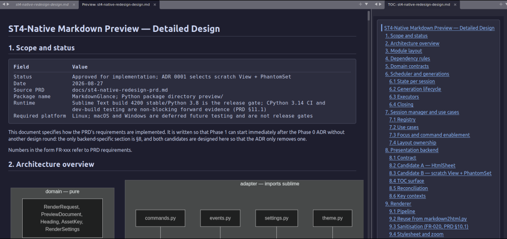
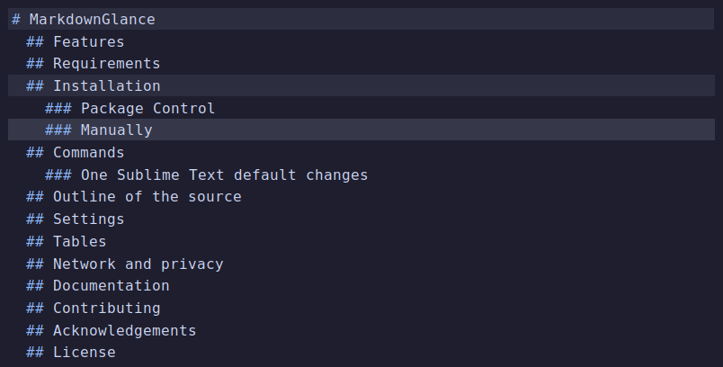

# MarkdownGlance

[](https://github.com/pandadolphin/MarkdownGlance/actions/workflows/markdown-glance.yml)
[](LICENSE)
[](https://www.sublimetext.com/)

Live Markdown preview for Sublime Text 4, rendered in an editor group of the
same window — no browser, no WebView, no external process.

<picture>
  <source media="(prefers-color-scheme: light)" srcset="docs/screenshots/preview-and-toc-light.png">
  
</picture>

Above: one Sublime Text window. The preview, the Mermaid diagram and the
aligned table are drawn by minihtml in an ordinary editor group, and the table
of contents on the right — `"enable_toc": true` — is a second group that
scrolls it. Nothing in the preview is styled by hand: it takes its colours from
the active color scheme, so the same document reads as
[dark](docs/screenshots/preview-and-toc-dark.png) or
[light](docs/screenshots/preview-and-toc-light.png) with the editor. The shot
above follows your own theme here, for the same reason.

## Features

- Live preview of saved and unsaved buffers, Side-by-Side or Full Screen.
- Theme-aware styling that follows the active color scheme.
- A separate, navigable table of contents, off by default.
- An outline of the Markdown source itself, with no preview open.
- Per-session zoom.
- Local images, and remote images fetched asynchronously under strict limits.
- GFM tables, typeset to the measured width of the preview.
- Optional Mermaid diagrams, disabled by default.

## Requirements

Sublime Text build 4200 or newer — that is the whole list. The package is pure
Python over the Sublime API, with no external dependency, and it is used on
Linux, macOS and Windows.

## Installation

### Package Control

MarkdownGlance has been submitted to Package Control, but the
[submission is still pending](https://github.com/sublimehq/package_control_channel/pull/9539)
and the package is not yet available from the official channel.

### Manual installation

For now, open **Preferences → Browse Packages…** in Sublime Text and clone
this repository into the directory it opens, under the name `MarkdownGlance`:

```bash
git clone https://github.com/pandadolphin/MarkdownGlance.git MarkdownGlance
```

Then open a Markdown file and run **MarkdownGlance: Open Preview to the Side**
from the Command Palette.

## Commands

| Command | Shortcut |
| --- | --- |
| MarkdownGlance: Open Preview to the Side | `Ctrl+K`, then `V` |
| MarkdownGlance: Toggle Preview | `Ctrl+Shift+V` |
| MarkdownGlance: Toggle Outline | `Ctrl+Shift+B` |
| MarkdownGlance: Zoom In / Out / Reset Zoom | `Ctrl+=`, `Ctrl+-`, `Ctrl+0` |
| Preferences: MarkdownGlance Settings | — |
| Preferences: MarkdownGlance Key Bindings | — |
| MarkdownGlance: Copy Diagnostics | — |

On macOS, `Cmd` replaces `Ctrl`. The zoom keys apply only while the preview
itself is focused, and every command is in the command palette with or without
a binding. `Ctrl`/`Cmd` with the scroll wheel zooms too, again only over a
focused preview; to change or drop that, bind the same button in your own
`Packages/User/Default (<Platform>).sublime-mousemap`.

### One Sublime Text default changes

`Ctrl+Shift+V` is Sublime Text's **Paste and Indent**. This package takes it for
the preview toggle, and only while a Markdown source view or a preview it owns
is focused — everywhere else the key is untouched.

That is deliberate. `Ctrl+Shift+V` is what VS Code and Zed bind their Markdown
preview to, and `Ctrl+K`, `V` beside it comes from the same place, so the
muscle memory is already yours. Paste and Indent, meanwhile, earns its key in
indentation-sensitive source — Python, C++ — rather than in Markdown prose. In
a Markdown buffer, plain `Ctrl+V` still pastes, and **Edit → Paste and Indent**
still runs the command by name.

If you would rather keep the key, delete that one entry from **Preferences →
Package Settings → MarkdownGlance → Key Bindings** and bind the toggle
elsewhere; `MarkdownGlance: Toggle Preview` is always in the command palette.
[ADR 0009](docs/adr/0009-full-screen-toggle-returns-to-ctrl-shift-v.md) records
the decision, including the chord that was tried in 0.1.2 and did not dispatch.

The open and toggle commands also work while an owned preview has focus.
Closing the source closes its preview; closing the preview never closes or
recreates the source. A group created by the plugin is restored only if its
layout has not been changed since.

## Outline of the source

`Ctrl+Shift+B` opens an outline of the Markdown file you are editing, in a
group of its own beside it — the headings as they are written, `#` markers and
all, indented by level. It reads the buffer, not the preview, so it works with
no preview open and on a file that has never been rendered.



The entry holding the caret is highlighted and the headings above it are
marked, both following the caret as you move it; the list re-scans as you type.
Clicking an entry moves the caret to that heading and centres it, leaving focus
in the outline so you can keep clicking. The key toggles the way Zed's outline
panel does: it opens and focuses, focuses if it is already open, and closes on
a press from inside it. Each file gets its own outline, which closes with its
source.

This shadows one more Sublime Text default: `Ctrl+Shift+B` is **Build With…**,
and the binding applies only while a Markdown source view or an outline this
package created is focused. Markdown has no build system, and plain `Ctrl+B`
is untouched everywhere.
[ADR 0010](docs/adr/0010-source-outline-and-ctrl-shift-b.md) records the
decision.

The table of contents inside the preview is a different thing: it is built from
the rendered document and scrolls the preview rather than the source. It is off
by default, because it takes an editor group of its own — set `"enable_toc":
true` and it appears once `toc_minimum_length` and `toc_minimum_headings` are
both met. Closing its tab hides it for that preview alone, until the preview is
closed and reopened.

Both take a group of their own, and both are only as wide as their longest
heading needs — measured from the text, capped at the share they used to take,
and re-fitted as you edit, zoom or resize. Drag the divider and the group stays
where you put it. `"auto_width": false` gives them the fixed share instead. See
[ADR 0011](docs/adr/0011-panel-width-fits-its-content.md).

## Settings

Run **MarkdownGlance: Open Settings** to see every setting with its default and
a comment. The defaults are conservative: Mermaid off, insecure remote images
blocked, and remote fetches bounded by timeout, payload size and dimension.

## Tables

Sublime Text's minihtml cannot lay out a table, so tables are typeset as
aligned monospace columns sized to the measured width of the preview: they fill
the group and re-fit when the window is resized. `table_max_columns` (200) only
caps that on a very wide screen. See
[ADR 0007](docs/adr/0007-table-rendering-under-minihtml.md).

## Network and privacy

Remote images are fetched off the UI thread with scheme, redirect, timeout,
payload and dimension limits, and are cached only in memory. Mermaid is
disabled by default; enabling it sends diagram source, and the preview's
background colour, to the configured Mermaid server. Diagnostics redact source
text, paths, URLs and Mermaid payloads.

## Documentation

- [Architecture](docs/architecture.md)
- [Architecture decision records](docs/adr)
- [Migrating from MarkdownLivePreview](docs/migration.md)
- [Manual test plan](docs/manual-test-plan.md)
- [Changelog](CHANGELOG.md)
- [Security policy](SECURITY.md)

## Contributing

Issues and pull requests are welcome. [CONTRIBUTING.md](CONTRIBUTING.md) covers
running the tests, trying a change inside Sublime Text, and what a pull request
should carry. In short:

```bash
python -m unittest discover -s MarkdownGlance/tests -t . -p 'test_*.py'
```

run from the parent of the package directory, which must be named
`MarkdownGlance`. CI runs the same suite on Linux, macOS and Windows against
Python 3.8 — the Sublime Text 4200 runtime — and 3.14.

## Acknowledgements

MarkdownGlance owes its idea to
[MarkdownLivePreview](https://github.com/math2001/MarkdownLivePreview) by
Mathieu Paturel — thank you for showing that a same-window Markdown preview
belongs in Sublime Text. MarkdownGlance is an independent implementation for
Sublime Text 4; the code here is its own.

## License

MIT. See [LICENSE](LICENSE). Vendored dependency attribution is recorded in
[THIRD_PARTY_NOTICES.md](THIRD_PARTY_NOTICES.md).
