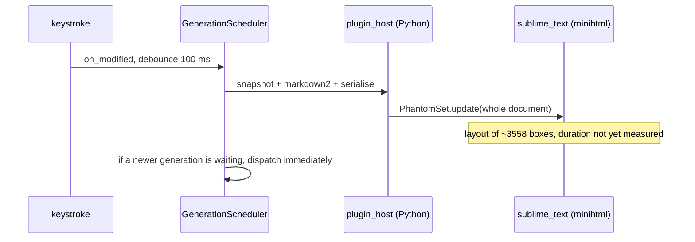

# Preview CPU and laptop fan noise

Status: **investigation, 2026-08-30.** The cheap no-op cuts have landed in
`9510ada`. This note is the remaining cost, and what would actually quiet a
Razer Blade 15.

## What was measured

Live preview of this repository's own
[`st4-native-redesign-design.md`](st4-native-redesign-design.md) (68 KB, 41
headings the renderer sees -- 46 `#` lines, five of them inside fences -- 27
tables and 23 fenced blocks) on Sublime Text 4200, Linux, X11, three
NVIDIA-driven displays:

| Process | Observation |
| --- | --- |
| `sublime_text` | 90–100 % of one core while the preview was live; ~20 % lifetime after 18 minutes |
| `plugin_host-3.8` | 6–8 % |
| CPU package | 79–83 °C while pegged; fans follow that, not GPU |

Python is not the heat. `PhantomSet.update()` of one `LAYOUT_BLOCK` phantom
is. After the serialiser change in `9510ada` that document is still ~178 KB of
HTML / ~3558 minihtml boxes, all laid out again on every real content change.

The firmware does not expose fan RPM; temperature and `sublime_text` CPU are
the signals.

## Cost model

Two properties keep the core hot for as long as someone is typing:

1. **One phantom is the whole document.** A one-character edit relayouts
   headings, tables and code that did not change.
2. **Catch-up dispatch has no trailing debounce.** Design §5.2 rule 1a
   (`GenerationScheduler._complete`) submits the next generation the instant
   the in-flight one returns. If layout lasts longer than `update_delay_ms`
   (default 100 ms), typing never leaves a gap: the native process stays at
   one full core. `tests/state/test_scheduler.py` pins this behaviour.

Secondary amplifiers, still live:

- `present()` calls `source_snapshot()` a second time only to take
  `len(markdown)` for `toc_required` (`usecases.py`).
- Viewport poll every 500 ms (`container._watch_viewports`) re-renders the
  whole document when the table column budget changes. A scrollbar appearing
  after layout shrinks `viewport_extent()[0]` and can do that without a
  keystroke.
- `_fit_toc` / `_fit` on every present may `window.set_layout`, which is the
  same width change.
- `OutlineController.refresh_source` still `reveal()`s on every
  `on_activated`. The TOC path no longer does; the outline path was not given
  the same treatment.
- With `enable_toc` on, a stock install pays for a second phantom and a third
  group. It ships `false`, and `RenderSettings.enable_toc` agrees, so this is a
  cost only for someone who has turned it on.

## Already done

Do not redo these. They stop *wasteful* layouts, not *necessary* ones, which
is why this note still has something to say. What they were and what each one
bought is in [`CHANGELOG.md`](../CHANGELOG.md) under *Performance* -- the
release record is the copy that gets maintained, so it is not repeated here.

Reload the package before measuring against them (`Tools → Reload Package`, or
restart Sublime Text). A long-lived `sublime_text` keeps burning on the old
phantom identity rule until `plugin_host` reloads, and `lib/markdown2.py`
draws its salt at import, so a stale host also keeps the old one.

## Mitigations, cheapest first

### 0. Operator, no code

- Close the preview (or the TOC) while editing a 60 KB+ file.
- User setting `"update_delay_ms": 400` (or 800) on this machine.
- `"enable_toc": false`, which is already the shipped default.

This is enough to stop the fan today. It does not fix the next user.

### 1. Trailing debounce on catch-up — do this first

In `GenerationScheduler._complete`, when `requested_generation` is ahead,
arm `update_delay_ms` again instead of calling `_dispatch` immediately.
Keep “at most one in flight” and “last edit is never lost”. Change the
scheduler test that currently asserts an immediate second `submit`.

Update design §5.2 rule 1a: catch-up waits one debounce. Promptness of the
*last* keystroke is unchanged; the *stream* of keystrokes stops pinning the
core.

Optional refinement: remember last `present` wall time and use
`max(update_delay_ms, last_layout_ms)` so a heavy document self-throttles.

### 2. Stop the remaining no-op native work

- Pass `len(request.markdown)` (or store it on `PreviewDocument`) into
  `toc_required`; do not snapshot the buffer on the UI thread after every
  render.
- Give `refresh_source` the TOC treatment: no `reveal()` on ordinary
  activation; skip `refresh` when headings and theme are unchanged.
- Viewport poll: only re-render when the column *budget* changes by at least
  two columns (hysteresis for the scrollbar), and skip the poll entirely
  when the last document had no tables.
- Call `LayoutOwner.fit` only when the measured heading width actually
  moved past `FIT_THRESHOLD`, which it already tries to do; do not fit on a
  present that did not change headings.

### 3. Default delay and a save-only escape hatch

Raise the shipped `update_delay_ms` from 100 to 300. Live preview still
feels live; 100 ms is faster than minihtml on this document. Confirm against
`recent_paints` first -- §4 below is what produces that number.

Add `"update_on_save": false`. When true, `source_modified` does not
schedule; `source_saved` does. For the design-doc workflow that is the
right trade: the fan goes to idle between saves.

A size gate is a reasonable default: if `view.size()` is past ~32 KiB, treat
the session as `update_on_save` unless the user has set a delay. Disclose it
in the status bar once, not on every keystroke.

### 4. What would actually get rid of the cost

Sectioned phantoms. `PhantomSet` already holds a list. Split `body_html` on
headings, keep one phantom per section, update only the dirty ones (plus a
small neighbour window so a heading split/merge is correct). Navigation can
keep using `layout_extent()` ratios, or sum the laid-out heights of the
phantoms above the target.

That is the only change that makes a one-line edit of a 68 KB file cheap.
Viewport virtualisation (drop off-screen sections) is a later step; Sublime
still has to know the height of what you skipped, so it is not a substitute
for dirty-section updates.

Do not reopen ADR 0001. `HtmlSheet` failed navigation and focused-shortcut
gates on this host; putting the same HTML in a sheet would still relayout
the whole document on `set_contents()`.

Do not cap fan RPM or drop the process nice. The package is at 80 °C because
it is doing the work; hiding the fan cooks the SKU.

## Suggested order

1. Trailing debounce + scheduler test + design §5.2 note.
2. Snapshot/`reveal`/viewport hysteresis from §2.
3. `update_delay_ms` 300 and `update_on_save`.
4. Measure again on `st4-native-redesign-design.md` with `debug_logging`:
   keystroke-to-`present` and `PhantomSet.update` wall time. Success is
   `sublime_text` returning to single-digit %CPU within one delay after the
   last key, package temperature falling through 60 °C without closing the
   preview.
5. Sectioned phantoms only if §1–3 leave typing on a 60 KB file still
   pegging a core. That is a new ADR, not a drive-by.

## Out of scope

Ghostty `llvmpipe`, Ollama VRAM, and the three-display NVIDIA idle (~16–20 W
at P8) are separate heat sources on this workstation. They were not what
pegged the package at 80 °C during this incident.
