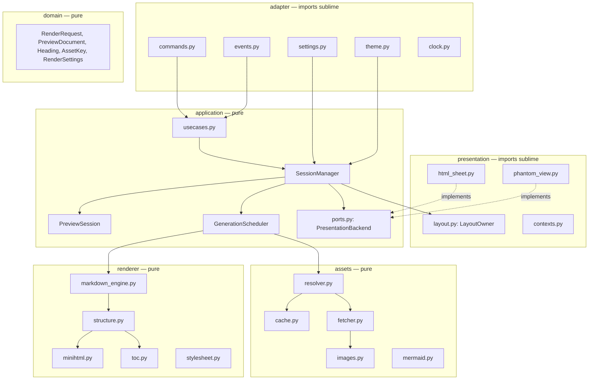
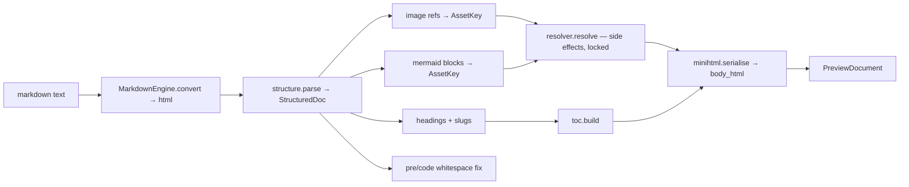

# ST4-Native Markdown Preview — Detailed Design

## 中文摘要

- 本文是 [`st4-native-redesign-prd.md`](st4-native-redesign-prd.md) 的实现设计，覆盖 module 划分、核心接口、session 状态机、generation 调度、asset service、renderer 复用边界、backend 契约以及 Phase 0 prototype 的具体做法。产品需求与 gate 定义以 PRD 为准，本文不重复。
- 当前 required platform 仅为 Linux；macOS/Windows compatibility testing 延后到 future testing，不阻塞 Phase 0、implementation 或首个 release（见 [1. Scope and status](#1-scope-and-status)）。
- 全部 Sublime API 调用被限制在 `adapter/` 和 `presentation/` 两层；`application/`、`domain/`、`renderer/`、`assets/` 不 import `sublime`，可用 CPython 3.8 与 3.14 直接跑测试（CI 两者都跑）（见 [3. Module layout](#3-module-layout)、[4. Dependency rules](#4-dependency-rules)）。
- 并发模型：每个 session 一个单调递增的 `generation`；render 与 network 分别使用 bounded `ThreadPoolExecutor`；所有结果回到 UI 线程后先比对 `generation` 再 apply。stale 结果、已关闭 session 的回调全部丢弃（见 [6. Scheduler and generations](#6-scheduler-and-generations)）。
- `PresentationBackend` 是唯一与 preview surface 交互的接口，两个候选（`HtmlSheet` / scratch `View` + `PhantomSet`）各实现一份；Phase 0 用同一套 contract test 与 gate 脚本对比后由 ADR 选定一个（见 [8. Presentation backend](#8-presentation-backend)）。
- renderer 拆分为三段：`markdown2` 转换 → HTML 结构化（headings、images、mermaid、pre 修复）→ minihtml 序列化；网络与缓存从 `markdown2html.py` 移入 `assets/`，renderer 只声明依赖、不发请求（见 [9. Renderer](#9-renderer)、[10. Asset service](#10-asset-service)）。
- layout ownership 在 window 级别：`LayoutOwner` 按 group 记录 `previous_layout`、fingerprint 与 holder 集合，最后一个 holder 关闭且 fingerprint 未变时才恢复；session 可持有 preview 与 TOC 两个 group（`layout_groups`），释放顺序固定为从右到左，close cause 矩阵决定是否 restore（见 [6.4](#64-closing)、[7.4 Layout ownership](#74-layout-ownership)）。
- close detection 区分 close trigger 与 safety-net trigger：cleanup 与 layout 恢复必须由 close 动作本身触发；`on_activated` 等只用于对账，不算通过 gate。Candidate A 的 navigation 只接受保留完整 document 的机制，"anchored window" 截断方案明确不算通过（见 [8.2](#82-candidate-a--htmlsheet)、[8.5](#85-reconciliation)）。
- scheduler 每 session 最多一个 in-flight render；in-flight 期间的新 edit 只抬高 `requested_generation`，完成后以 `completed_generation`（成败都前进）为依据立即 dispatch 最新一代，既保证最后一次 edit 必定被渲染，也避免失败的最新一代无限重试（见 [6.2](#62-generation-lifecycle)）。
- renderer 拆为 `parse`（pure）→ `resolver.resolve`（唯一副作用步，`RLock` 保护，网络完成回调先 marshal 到 UI 线程）→ `serialise`（pure）；`pending_assets` 由 resolver 的返回值推导（见 [9.1](#91-pipeline)、[10.1](#101-resolver)）。
- navigation：Candidate B 沿用现有 ratio × `layout_extent()` 方案；Candidate A 没有任何 API 能定位 `HtmlSheet`，只可能以 in-preview TOC + fragment link 形式通过 gate 2，即 A 与 separate TOC sheet 互斥，需写入 ADR（见 [8.2](#82-candidate-a--htmlsheet)、[8.3](#83-candidate-b--scratch-view--phantomset)）。
- diagnostics/log 只允许出现 `AssetKey.safe_label`（host/basename + hash），Mermaid URL 的 path 含 diagram 源码，任何模式下都不记录（见 [5](#5-domain-contracts)、[10.2](#102-fetcher)）。
- 已解决的 implementation gates：ADR 0001 选择 scratch `View` + `PhantomSet`，ADR 0003 删除 `bs4`，ADR 0005 将 Mermaid 设为 opt-in；Linux/ST 4200 证明 minihtml root zoom 必须使用 `px`，preview `View` 必须启用 `word_wrap`。

## 1. Scope and status

| Field | Value |
| --- | --- |
| Status | Approved for implementation; ADR 0001 selects scratch `View` + `PhantomSet` |
| Date | 2026-08-27 |
| Source PRD | `docs/st4-native-redesign-prd.md` |
| Package name | `MarkdownGlance`; Python package directory `preview/` |
| Runtime | Sublime Text build 4200 stable/Python 3.8 is the release gate; CPython 3.14 CI and dev-build testing are non-blocking forward evidence (PRD §11.1) |
| Required platform | Linux; macOS and Windows are deferred future testing and are not release gates |

This document specifies how the PRD's requirements are implemented. It is
written so that Phase 1 can start immediately after the Phase 0 ADR without
another design round: the only backend-specific section is §8, and both
candidates are designed here so that the ADR only removes one.

Numbers in the form FR-xxx refer to PRD requirements.

## 2. Architecture overview



Control flow in one sentence: an adapter event becomes a use-case call; the
`SessionManager` mutates a `PreviewSession`, asks the `GenerationScheduler` to
produce a `PreviewDocument` for a new generation, and — back on the UI thread —
applies it through the session's `PresentationBackend` if it is still the latest.

## 3. Module layout

```text
MarkdownGlance/
├── .python-version                 # "3.8"
├── plugin.py                       # ST entry: re-exports commands/listeners, plugin_loaded/unloaded
├── Default (Linux|OSX|Windows).sublime-keymap
├── Default (Linux|OSX|Windows).sublime-mousemap
├── Default.sublime-commands
├── Main.sublime-menu               # optional; Preferences > Package Settings entry
├── MarkdownGlance.sublime-settings
├── messages.json, messages/        # install + privacy notice (FR-040)
├── preview/
│   ├── __init__.py
│   ├── adapter/
│   │   ├── commands.py             # sublime_plugin.WindowCommand / TextCommand classes
│   │   ├── events.py               # EventListener + ViewEventListener
│   │   ├── settings.py             # SettingsAdapter: sublime.Settings -> RenderSettings + on_change
│   │   ├── theme.py                # ThemeSnapshot from view.style()
│   │   ├── clock.py                # set_timeout / set_timeout_async wrappers
│   │   └── executors.py            # owned ThreadPoolExecutors, shutdown on unload
│   ├── application/
│   │   ├── ports.py                # PresentationBackend, AssetResolverPort, Clock, RunOnUi protocols; SurfaceHandle
│   │   ├── render_pipeline.py      # render(): parse → resolve → serialise composition (runs on worker)
│   │   ├── session.py              # PreviewSession dataclass + state enum + invariants
│   │   ├── session_manager.py      # registry, lookups, lifecycle transitions
│   │   ├── scheduler.py            # GenerationScheduler: debounce, dispatch, apply-if-latest
│   │   └── usecases.py             # open_side_by_side, toggle_fullscreen, zoom, navigate, close…
│   ├── domain/
│   │   ├── contracts.py            # RenderRequest, PreviewDocument, Heading, AssetKey, FetchedAsset, AssetResult, diagnostics
│   │   ├── settings.py             # RenderSettings + validation/defaults
│   │   └── ids.py                  # SessionId, ActionToken generation
│   ├── renderer/
│   │   ├── markdown_engine.py      # MarkdownEngine protocol + Markdown2Engine
│   │   ├── structure.py            # HTML -> structured intermediate (headings, images, mermaid, pre)
│   │   ├── toc.py                  # heading tree, slugs, TOC HTML
│   │   ├── minihtml.py             # serialisation + allowlist + <br /> fix
│   │   ├── stylesheet.py           # CSS assembly with theme variables and zoom
│   │   └── errors.py               # error/loading card HTML
│   ├── assets/
│   │   ├── resolver.py             # AssetResolver: AssetKey -> data | placeholder, schedules fetches
│   │   ├── fetcher.py              # HTTPS fetch with limits, redirects, timeouts
│   │   ├── images.py               # header sniff + dimensions (PNG/JPEG/GIF)
│   │   ├── cache.py                # bounded LRU + negative cache with TTL
│   │   ├── mermaid.py              # diagram -> request URL
│   │   └── policy.py               # NetworkPolicy (scheme, size, timeout, enable flags)
│   └── presentation/
│       ├── html_sheet.py           # Candidate A (implements application.ports.PresentationBackend)
│       ├── phantom_view.py         # Candidate B
│       ├── layout.py               # LayoutOwner: fingerprint, create/restore group
│       └── contexts.py             # on_query_context keys for owned surfaces
├── lib/                            # vendored markdown2 2.3.9 (MIT); no bs4
├── resources/
│   ├── preview.css
│   ├── loading.png, missing.png    # embedded as data URIs at load
│   └── ...
├── tests/
│   ├── unit/
│   ├── state/
│   ├── contract/                   # backend contract tests (run inside ST)
│   └── fixtures/
│       ├── benchmark-100k.md
│       ├── backend-scroll.md
│       └── ...
└── docs/
    ├── architecture.md             # this document, trimmed after Phase 0
    ├── migration.md
    ├── verification/
    ├── adr/
    └── manual-test-plan.md
```

`plugin.py` is the only file Sublime scans for command classes; it does
`from .preview.adapter.commands import *` and `from .preview.adapter.events import *`.
All other modules are imported relatively so the package directory name is the
only thing that changes when the name is chosen.

## 4. Dependency rules

Enforced by a unit test that imports every module under `domain/`, `renderer/`,
`assets/` and `application/` with a fake `sublime` module that raises on
import (`adapter/` and `presentation/` legitimately import it and are covered
by the in-ST contract suite instead):

| Layer | May import | Must not import |
| --- | --- | --- |
| `domain` | stdlib | anything else in the package |
| `renderer` | `domain`, `lib/markdown2` | `sublime`, `assets`, `application` — it exposes `parse()`/`serialise()` only and never sees a resolver |
| `assets` | `domain`, stdlib `urllib`, `ssl`, `struct` | `sublime`, `renderer` |
| `application` | `domain`, `renderer`, `assets` | `sublime`, `presentation`, `adapter` |
| `presentation` | `sublime`, `domain`, `application.ports` (protocols and `SurfaceHandle` only) | `renderer`, `assets`, other `application` modules |
| `adapter` | everything | — |

`application/ports.py` defines the outbound interfaces (`PresentationBackend`,
`Clock`, `RunOnUi`) as `typing.Protocol`s and the `SurfaceHandle` value type;
`presentation` implements them and `adapter` injects the implementations at
`plugin_loaded()`. The dependency direction is therefore strictly
`adapter → presentation → application.ports`, with no edge back into
`application` from `presentation`.

## 5. Domain contracts

```python
# preview/domain/contracts.py
from dataclasses import dataclass, field
from typing import Optional, Tuple, Union
from enum import Enum


class PreviewMode(Enum):
    SIDE_BY_SIDE = "side_by_side"
    FULL_SCREEN = "full_screen"


class AssetKind(Enum):
    LOCAL_IMAGE = "local_image"
    REMOTE_IMAGE = "remote_image"
    MERMAID = "mermaid"


@dataclass(frozen=True)
class AssetKey:
    kind: AssetKind
    locator: str            # canonical absolute path, canonical URL, or mermaid request URL. NEVER logged.

    @property
    def safe_label(self) -> str:
        """The only form that may appear in diagnostics, logs, placeholders or
        error cards: kind + host (remote) or basename (local) + 8-hex sha256 of
        locator. Mermaid keys carry only the server host + hash; the diagram
        source is encoded in the URL *path*, so query stripping would not hide it."""


@dataclass(frozen=True)
class ThemeSnapshot:
    background: str         # "#rrggbb" from view.style()["background"]
    foreground: str
    is_dark: bool
    accent: str             # scheme "accent" if present, else derived


@dataclass(frozen=True)
class RenderSettings:
    update_delay_ms: int = 100
    enable_mermaid: bool = False
    mermaid_server: str = "https://mermaid.ink"
    allow_insecure_remote_images: bool = False
    remote_timeout_seconds: float = 15.0
    remote_max_bytes: int = 10 * 1024 * 1024
    remote_max_dimension: int = 4096
    toc_minimum_length: int = 1200
    toc_minimum_headings: int = 3
    debug_logging: bool = False


@dataclass(frozen=True)
class RenderRequest:
    session_id: str
    generation: int
    markdown: str
    base_path: Optional[str]        # directory for relative assets, or None
    zoom: float                     # 0.5 .. 3.0; consumed by stylesheet.py only, never by parse/serialise
    settings: RenderSettings
    theme: ThemeSnapshot


@dataclass(frozen=True)
class Heading:
    level: int                      # 1..6
    text: str
    slug: str                       # unique within document
    ordinal: int                    # 0-based document order
    position_ratio: float           # heading offset / document length, 0..1 (used by Candidate B navigation)


class DiagnosticStage(Enum):
    PARSE = "parse"
    STRUCTURE = "structure"
    ASSET = "asset"
    SERIALISE = "serialise"


@dataclass(frozen=True)
class RenderDiagnostic:
    stage: DiagnosticStage
    message: str                    # never contains document text or URL query strings


@dataclass(frozen=True)
class FetchedAsset:
    """A resolved asset. Lives in domain so that renderer (serialise) and
    assets (fetcher/cache) share it without either importing the other."""
    data_uri: str
    width: int
    height: int
    response_bytes: int        # bytes received on the wire (or file size); checked against remote_max_bytes
    cache_cost_bytes: int      # len(data_uri); what the LRU budget counts (base64 is ~4/3 of response_bytes)
    effective_scheme: str      # scheme of the FINAL URL after redirects ("https", "http", "file")
    fetched_revision: int      # policy revision at submission


class AssetStatus(Enum):
    LOADING = "loading"
    UNAVAILABLE = "unavailable"
    BLOCKED = "blocked"
    TOO_LARGE = "too_large"
    TIMEOUT = "timeout"


@dataclass(frozen=True)
class Ready:
    asset: FetchedAsset

@dataclass(frozen=True)
class Pending:
    pass

@dataclass(frozen=True)
class Failed:
    status: AssetStatus

AssetResult = Union[Ready, Pending, Failed]   # serialise() reads only data_uri/width/height and status


@dataclass(frozen=True)
class PreviewDocument:
    generation: int
    body_html: str                  # minihtml body without <style>, zoom-independent
    headings: Tuple[Heading, ...]
    asset_dependencies: Tuple[AssetKey, ...]
    pending_assets: Tuple[AssetKey, ...]   # currently shown as placeholders
    links: Tuple[str, ...]                 # relative document links, indexed by plugin links (§9.3)
    diagnostics: Tuple[RenderDiagnostic, ...] = ()
```

Design points:

- `body_html` is zoom-independent; zoom is applied by `stylesheet.py` at
  presentation time so FR-060 ("zoom does not reparse") is structural, not a
  cache trick. Image `width`/`height` are emitted in `rem` computed at 100%
  zoom (§9.4); no zoom value is baked into `body_html`, and a unit test
  asserts that rendering the same request at zoom 1.0 and 2.0 yields
  byte-identical `body_html`.
- `pending_assets` lets the scheduler know a later asset completion should
  trigger a rerender for this session (FR-031 last bullet).
- `RenderDiagnostic.message` is constructed only from fixed strings and
  `AssetKey.safe_label` (FR-012, FR-031). `locator` never reaches a message,
  log line, placeholder caption or the diagnostics command; a unit test greps
  rendered error cards and captured log output for the locator of a Mermaid
  fixture and asserts absence.

## 6. Scheduler and generations

### 6.1 State per session

```python
# preview/application/session.py
class SessionState(Enum):
    OPENING = "opening"
    RENDERING = "rendering"
    VISIBLE = "visible"
    MOVING = "moving"
    ERROR = "error"
    CLOSING = "closing"


@dataclass
class PreviewSession:
    id: str
    window_id: int
    source_buffer_id: int
    source_sheet_id: int
    preview_surface: Optional["SurfaceHandle"]
    toc_surface: Optional["SurfaceHandle"]
    mode: PreviewMode
    state: SessionState
    zoom: float = 1.0
    requested_generation: int = 0
    completed_generation: int = 0   # last generation whose result (success or failure) was processed
    successful_generation: int = 0  # last generation that produced a PreviewDocument and was shown; an error card does NOT advance it
    last_document: Optional[PreviewDocument] = None
    pending_assets: FrozenSet[AssetKey] = frozenset()
    layout_groups: Set[int] = field(default_factory=set)   # owned groups, see §7.4
    action_token: str = ""                     # random; validates plugin links (FR-061)
```

Invariants (checked in `__post_init__`-style `validate()` called by tests and,
in debug mode, after every transition):

- `successful_generation <= completed_generation <= requested_generation`
- `state == VISIBLE` implies `last_document is not None and successful_generation == requested_generation`
- `state == ERROR` implies `completed_generation == requested_generation > successful_generation`
- `state in (CLOSING,)` implies no pending futures reference the session (see 6.4)

### 6.2 Generation lifecycle

```mermaid
sequenceDiagram
    participant UI as UI thread
    participant S as GenerationScheduler
    participant X as render executor
    participant B as PresentationBackend

    UI->>S: request_render(session, reason)
    S->>S: session.requested_generation += 1 → N
    S->>S: cancel pending debounce timer; arm timer(update_delay_ms)
    Note over S: timer fires on UI thread
    S->>S: build RenderRequest(N) from live view (snapshot)
    S->>X: submit(render, request)
    X-->>S: future.done → set_timeout(apply, 0)   # back to UI thread
    S->>S: if session closed or N != requested_generation → discard
    S->>B: update(surface, html(N)); session.completed_generation = N; on success also successful_generation = N
```

Rules:

1. All session mutation happens on the UI thread. `request_render()` may be
   called from any thread; it does nothing but `run_on_ui(lambda: self._request(session_id, reason))`.
   `_request` increments `requested_generation` and (re)arms the debounce
   timer. A burst of edits therefore produces one dispatch whose generation
   equals the last edit's.
1a. **At most one render in flight per session.** When the timer fires and a
   render is already in flight, no new future is submitted; the session is
   simply left with `requested_generation > inflight_generation`. When the
   in-flight future completes (on the UI thread), `completed_generation` is
   set to its generation whether it succeeded or failed; its result is applied
   or discarded by rule 3; then — if `requested_generation > completed_generation`
   and no debounce timer is pending — the latest generation is dispatched
   immediately without a further delay. This guarantees the last edit is
   always rendered, and that a failing latest generation is rendered once, not
   in a loop: `successful_generation` is deliberately *not* the dispatch
   criterion because it does not advance on failure.
2. Snapshotting (`view.substr(sublime.Region(0, view.size()))`, file name,
   settings, theme) happens on the UI thread when the timer fires; workers
   never touch `sublime` objects. No viewport dimension enters the request:
   width constraints are handled by CSS (§9.4), so a group resize never
   requires a rerender.
3. The worker returns `PreviewDocument` or raises `RenderFailure(stage, message)`.
   `apply()` converts either into a backend update; a failure produces
   `state = ERROR` and an error card *above* `last_document.body_html` when one
   exists (FR-012).
4. `apply()` runs on the UI thread through `sublime.set_timeout(cb, 0)`.
   Nothing in `application` calls `sublime` directly; the scheduler receives a
   `run_on_ui(callable)` and a `Clock` from the adapter.
5. Asset completion calls `scheduler.asset_available(key)`. The scheduler finds
   sessions with `key in session.pending_assets` and calls `request_render()`
   with reason `ASSET`; other sessions are untouched.
6. Zoom, theme and settings changes that do not alter parsing call
   `scheduler.represent(session)`: same `last_document`, new stylesheet, no
   executor round-trip. Settings that alter parsing or assets (mermaid, toc
   thresholds, network policy) call `request_render()`.

### 6.3 Executors

```python
# preview/adapter/executors.py
render_executor  = ThreadPoolExecutor(max_workers=2, thread_name_prefix="mdglance-render")
network_executor = ThreadPoolExecutor(max_workers=4, thread_name_prefix="mdglance-net")
```

- Two pools so a slow server cannot starve rendering (PRD §9).
- `plugin_unloaded()` calls `shutdown(wait=False)`; on Python 3.9+
  `cancel_futures=True` is passed when available (guarded with a version check
  so 3.8 keeps working).
- Render queue depth is exactly one per session: `session._inflight:
  Optional[Tuple[int, Future]]` holds the in-flight generation. Newer requests
  never submit while it is set (rule 6.2-1a); they only raise
  `requested_generation`. Consequently a stale result can only be the single
  in-flight one, and it is discarded by rule 6.2-3 before the latest is
  dispatched.

### 6.4 Closing

`SessionManager.close(session, cause)` with `cause ∈ {SOURCE_CLOSED,
PREVIEW_CLOSED_BY_USER, WINDOW_CLOSED, UNLOAD}`:

1. `state = CLOSING`; `requested_generation += 1` so any in-flight result is stale.
2. Remove `session.id` from every asset-waiter set in the resolver.
3. Close owned surfaces according to the cause matrix below. Never touch the
   source sheet (PRD §10.3).
4. Release owned layout groups in the order defined in §7.4 (TOC group first,
   then preview group), passing `restore` from the matrix.
5. Delete from registry; `state = CLOSED` exists only as absence from the registry.

| cause | close preview surface | close TOC surface | layout `restore` |
| --- | --- | --- | --- |
| `SOURCE_CLOSED` | yes (if alive) | yes (if alive) | yes |
| `PREVIEW_CLOSED_BY_USER` | no — already gone; `is_alive()` is false | yes (if alive) | yes |
| `WINDOW_CLOSED` | yes (if alive; usually a no-op) | yes | no |
| `UNLOAD` | yes | yes | no |

The user closing only the TOC surface is not a session close: `_drop_toc()`
closes nothing, releases the TOC group with `restore=True`, sets
`toc_surface = None`, and leaves the preview running.

## 7. Session manager and use cases

### 7.1 Registry

```python
class SessionManager:
    _by_id: Dict[str, PreviewSession]
    _by_source: Dict[Tuple[int, int], str]       # (window_id, source_buffer_id) -> session id
    _by_surface: Dict[int, str]                  # surface id (sheet or view id) -> session id
```

Lookups always re-validate against Sublime (`backend.is_alive(handle)`,
`window.is_valid()`); a miss triggers `reconcile(window)` (§8.5) before the
use case proceeds. IDs are never trusted alone (PRD §7.4).

### 7.2 Use cases

| Use case | Trigger | Effect |
| --- | --- | --- |
| `open_side_by_side(window, source_view)` | FR-001 command | find-or-create session; `p = layout_owner.acquire(window, source_group, PREVIEW, id)`; if separate TOC: `t = layout_owner.acquire(window, p, TOC, id)`; create/move surfaces; `request_render(OPEN)` |
| `toggle_full_screen(window, active_sheet)` | FR-002 command | Branch on session state and on what `active_sheet` is: **no session** → create in source group, `focus(preview)`. **SIDE_BY_SIDE** (from source, preview or TOC) → `switch_mode(FULL_SCREEN)`. **FULL_SCREEN, active = preview** → `close(session, PREVIEW_CLOSED_BY_USER)` semantics but plugin-initiated: close preview and TOC, release groups with `restore=True`, focus source. **FULL_SCREEN, active = source** → `focus(preview)` (the preview exists but is hidden behind the source; toggling reveals it rather than closing it). **FULL_SCREEN, active = owned TOC** → `focus(preview)` — same as from source; closing from the TOC is not offered, the user closes the preview from the preview. State tests cover all five branches. |
| `switch_mode(session, mode)` | called by above | release or acquire layout groups per §7.4 table; `backend.move(preview, group)`; a separate TOC surface is never placed in the same group as the preview (one active sheet per group would hide it, violating FR-050) — in Full Screen it gets its own narrow group to the right of the source group; zoom and `last_document` retained; `represent()` |
| `adjust_zoom(session, delta)` / `reset_zoom` | FR-060 keys, mousemap | clamp to [0.5, 3.0] step 0.1; `represent()`; update TOC surface too |
| `navigate(session, slug)` | FR-050 plugin link (only when `backend.navigation == PROGRAMMATIC`) | `backend.navigate(handle, slug)`; mark active TOC entry; `represent_toc()` |
| `source_modified(view)` | `on_modified_async` | `request_render(EDIT)` for its session if any |
| `source_saved / renamed` | `on_post_save_async`, file-name change detected in `on_activated` | recompute `base_path`; `request_render(SAVE)` |
| `theme_changed(window)` | settings `color_scheme` change on any owned source view | new `ThemeSnapshot`; `represent()` for all sessions in window |
| `settings_changed()` | `Settings.add_on_change` | re-parse `RenderSettings`; for each session: `represent()` or `request_render(SETTINGS)`; `policy.revision += 1` (drops in-flight fetches) |
| `source_closed(view)` | `on_pre_close` | `close(session, SOURCE_CLOSED)` |
| `surface_closed(handle)` | backend-specific (§8) | `close(session, PREVIEW_CLOSED_BY_USER)` |
| `window_closed(window)` | `on_pre_close_window` | close all sessions of window; no layout restore |

### 7.3 Focus and command enablement

Commands are `WindowCommand`s (they must work with focus on an `HtmlSheet`,
which has no `View`). `is_enabled()`:

- `open_side_by_side`, `toggle_full_screen`: active sheet is a Markdown view
  (`view.match_selector(0, "text.html.markdown")`) **or** an owned preview
  surface.
- zoom/navigate commands: active sheet is an owned surface.

Key bindings use `on_query_context` keys `mdglance.preview_focused` and
`mdglance.markdown_source` (implemented in `presentation/contexts.py`, §8.6),
never `setting.*` keys, because Candidate A surfaces have no settings.

### 7.4 Layout ownership

Ownership is per window, not per session, because several sessions may share
one plugin-created group.

```python
@dataclass
class OwnedGroup:
    group: int
    previous_layout: dict        # layout before the plugin created the group
    fingerprint: str             # layout right after creation
    holders: Set[str]            # session ids currently placed in this group


class LayoutOwner:
    _owned: Dict[int, Dict[int, OwnedGroup]]   # window_id -> group -> OwnedGroup

    def acquire(self, window, anchor_group: int, role: GroupRole, session_id: str) -> int:
        """Return the index of the group immediately to the right of
        `anchor_group` for `role` (PREVIEW or TOC), creating it when the anchor
        is the rightmost group in its row. Never consults the active group, so
        consecutive calls acquire(src, PREVIEW) -> p and acquire(p, TOC) -> t
        return distinct groups. Creation gives the NEW right-hand group
        ROLE_SHARE[role] of the anchor's width (PREVIEW: 0.5, TOC: 0.22) and
        leaves the anchor the rest, records OwnedGroup, and adds session_id to
        holders. If a group already exists to the right of the anchor it is
        returned and nothing is owned; if it is already owned, the holder is
        added. FR-001 requires a right-hand group to be created when none
        exists, so there is no fallback to opening in the anchor group.
        "Group to the right" means a cell in the same row band whose c0 index
        equals the anchor's c1 index."""

    @staticmethod
    def split_cell(layout: dict, cell_index: int, new_share: float) -> Tuple[dict, int]:
        """Pure function over window.layout() dicts. In Sublime's layout
        format `cols`/`rows` are sorted fractional boundaries and each cell is
        [c0, r0, c1, r1] of INDICES into those lists (see the set_layout
        example in the key-bindings docs), so:

          x0, x1 = cols[c0], cols[c1]                # anchor may span several intervals (c1 > c0 + 1)
          x_new  = x1 - (x1 - x0) * new_share        # new group is on the right
          k = bisect_left(cols, x_new)
          if k < len(cols) and abs(cols[k] - x_new) < 1e-6:
              inserted = False                       # boundary already exists (from another row)
          else:
              cols.insert(k, x_new); inserted = True
              for every cell: any column index >= k is incremented by 1
                              (this includes cells in other rows — their
                              indices shift although their geometry does not)
          c1' = c1 + 1 if inserted and c1 >= k else c1   # anchor's right edge after re-indexing
          anchor cell becomes [c0, r0, k,  r1]
          new cell     is     [k,  r0, c1', r1], appended to cells
        Returns (new_layout, index of the new cell). Because c1 may exceed
        c0 + 1 when other rows introduced intermediate boundaries, the new
        cell's right edge is the anchor's ORIGINAL right boundary, not k + 1.
        Unit-tested on 1x1, 2-column, 2-row, 2x2, a nested fixture where the
        anchor spans three intervals, and a fixture where x_new coincides
        with an existing boundary; each asserts that every cell's geometry
        other than the anchor's is unchanged after re-indexing, that
        cols/rows stay strictly sorted, and that the new cell's width equals
        new_share of the anchor's former width."""
    def release(self, window, group, session_id) -> None:
        """Remove the holder. When holders becomes empty: if the group is empty
        of sheets and fingerprint(window) == owned.fingerprint, set
        previous_layout; in all cases forget the OwnedGroup."""
    def invalidate(self, window) -> None:
        """Called from on_post_window_command for set_layout/new_pane/close_pane
        not issued by the plugin: drop every OwnedGroup of the window."""
    @staticmethod
    def fingerprint(window) -> str:
        return json.dumps(window.layout(), sort_keys=True)
```

`release()` takes a `restore: bool`; restoration happens only when the last
holder is released, `restore` is true, the group is empty of sheets, and the
fingerprint still matches (FR-001, PRD §8). Any user layout change invalidates
ownership for the whole window.

A session may hold up to two groups (`PreviewSession.layout_groups`): the
preview group and, if the TOC is a separate surface, a narrow third column.
Because the TOC column is created after the preview column, its
`previous_layout` is the two-column layout, and the preview group's
`previous_layout` is the original one; releases must therefore run right to
left so that each fingerprint check sees the layout it expects. The order and
`restore` value per event:

| Event | Release order | `restore` |
| --- | --- | --- |
| Preview closed by user | TOC group, then preview group | true |
| Source closed | TOC group, then preview group | true |
| TOC closed by user (`_drop_toc`) | TOC group only | true |
| Mode switch → Full Screen | 1. `backend.move(preview, source_group)` and, if separate, `backend.move(toc, source_group)` — the owned groups are now empty; 2. release TOC group, then preview group (`restore=True`; the emptiness check now passes and the layout returns to what it was before Side-by-Side); 3. if the TOC is separate: `t = acquire(source_group, TOC)`, `backend.move(toc, t)`, `backend.reveal(toc)`; 4. `backend.focus(preview)` — `move()` never activates, and `reveal()` restores the previous active group (where the source is still on top), so without this step the preview would be a hidden tab behind the source. Net effect: `[source+preview | TOC]` with `window.active_sheet()` = preview. Order matters: releasing before moving would fail the empty-group check, forget the `OwnedGroup`, and strand two empty groups | true (step 2) |
| Mode switch → Side-by-Side | 1. if separate TOC: move it into the source group and release its Full-Screen TOC group (`restore=True`); 2. `p = acquire(source_group, PREVIEW)`, `backend.move(preview, p)`; 3. `t = acquire(p, TOC)`, `backend.move(toc, t)`, `backend.reveal(toc)` (TOC gets 0.22 of the preview group, i.e. ~11% of the original width); 4. `backend.focus(preview)` | true (step 1) |
| Window closed / plugin unload | TOC group, then preview group | false |
| User layout change (`invalidate`) | all `OwnedGroup`s of the window dropped; sessions keep `layout_groups` but releases become no-ops | — |

Group placement per mode, for a separate TOC surface:

| Mode | Groups (left → right) | Owned by session |
| --- | --- | --- |
| Side-by-Side | `source` · `preview` · `TOC` | preview group, TOC group |
| Full Screen | `source + preview` (preview is the active sheet) · `TOC` | TOC group |

The TOC therefore always has a group of its own while a preview is shown, and
`toggle_full_screen` from the preview closes the preview *and* releases the
TOC group. For an inline TOC (`FRAGMENT_ONLY` backend) none of this applies.

General rule for every transition: **move surfaces out first, release groups
second, acquire and move in third.** `release()` restores only when the group
is empty, so a surface must never still be inside a group being released.
The state-model tests assert, after every transition, that no owned group is
empty, that the window's layout equals the expected fingerprint, that
`active_sheet()` is the preview, and — for a separate TOC — that
`active_sheet_in_group(toc_group)` is the TOC.

## 8. Presentation backend

### 8.1 Contract

```python
# preview/application/ports.py
@dataclass(frozen=True)
class SurfaceHandle:
    kind: str          # "html_sheet" | "phantom_view"
    id: int            # sheet id or view id
    window_id: int


class NavigationCapability(Enum):
    PROGRAMMATIC = "programmatic"   # navigate() moves the surface; TOC may live in a separate surface
    FRAGMENT_ONLY = "fragment_only" # only in-document <a href="#slug"> works; TOC must be inline; navigate() is never called
    NONE = "none"                   # fails PRD gate 2; cannot be selected


class PresentationBackend(Protocol):
    name: str
    navigation: NavigationCapability

    def create(self, window, group: int, title: str, session_id: str) -> SurfaceHandle: ...
    def update(self, handle: SurfaceHandle, html: str) -> None: ...
    def navigate(self, handle: SurfaceHandle, slug: str) -> bool: ...   # required True only when navigation == PROGRAMMATIC
    def move(self, handle: SurfaceHandle, group: int) -> None: ...     # set_sheet_index(); does NOT activate
    def reveal(self, handle: SurfaceHandle) -> None: ...                # make it the active sheet of ITS group without changing the active group
    def focus(self, handle: SurfaceHandle) -> None: ...                 # activate sheet AND its group
    def close(self, handle: SurfaceHandle) -> None: ...
    def is_alive(self, handle: SurfaceHandle) -> bool: ...
    def group_of(self, handle: SurfaceHandle) -> Optional[int]: ...
    def set_title(self, handle: SurfaceHandle, title: str) -> None: ...
    def live_handles(self, window) -> List[SurfaceHandle]: ...   # for reconciliation
    def owner_of(self, sheet_or_view) -> Optional[str]: ...      # session id if owned
```

`move()` and `reveal()` are distinct because Sublime distinguishes
`set_sheet_index()` from `active_sheet_in_group()`: moving a sheet into a
group that already holds user sheets leaves whichever sheet was active there
on top. `reveal()` is implemented as `focus_group(g); focus_sheet(h);
focus_group(previous)` executed synchronously so the user-visible focus does
not change; it is called after every TOC placement so the TOC is visible
even when `acquire()` returned an existing, populated user group (FR-050)
while the preview keeps keyboard focus. The contract suite includes a
*populated-group* case: pre-create two user sheets in the right-hand group,
place the TOC, and assert `active_sheet_in_group(g)` is the TOC and
`active_group()` is unchanged.

`navigation` is the backend's declared capability and drives both the TOC form
and the contract tests:

| capability | TOC form | `navigate()` contract | `navigate` use case |
| --- | --- | --- | --- |
| `PROGRAMMATIC` (Candidate B) | separate surface or inline | must return `True` for every heading of the contract fixture | called from plugin TOC links |
| `FRAGMENT_ONLY` (Candidate A) | inline only, with persistent visibility (§8.2 gate 2b) | never called; contract test asserts it is not invoked | not registered; TOC entries are `href="#slug"` |
| `NONE` | — | — | backend is rejected by the ADR |

The contract suite (§12) selects its navigation cases by this attribute, so a
backend cannot pass by declaring a capability it does not implement: a
`PROGRAMMATIC` backend that returns `False` fails, and a `FRAGMENT_ONLY`
backend is exercised through the in-ST gate 2 script instead.

Ownership tagging must survive a plugin reload (module state is lost, Sublime
objects persist). Both backends record ownership in Sublime-owned storage:

- Candidate B: `view.settings().set("mdglance.session", id)`.
- Candidate A: `HtmlSheet` has no settings, so ownership is written to
  `window.settings().set("mdglance.html_sheets", {str(sheet.id()): session_id})`
  (window settings persist for the life of the window and sheet ids are
  stable within a Sublime process). `owner_of()` and `live_handles()` read this
  map; `close()` removes the entry.

A sheet whose id is absent from Sublime-owned storage is **never** touched:
the plugin cannot prove it is its own, and other packages create
`HtmlSheet`s too. After a reload, `plugin_loaded()` rebuilds registry entries
from the storage as orphan sessions with no source and closes *those*
surfaces; entries whose sheet no longer exists are dropped from the map.

### 8.2 Candidate A — `HtmlSheet`

```python
class HtmlSheetBackend:
    OWNER_KEY = "mdglance.html_sheets"

    def create(self, window, group, title, session_id):
        sheet = window.new_html_sheet(title, "", flags=0, group=group)
        owners = dict(window.settings().get(self.OWNER_KEY, {}))
        owners[str(sheet.id())] = session_id
        window.settings().set(self.OWNER_KEY, owners)     # survives plugin reload (§8.1)
        return SurfaceHandle("html_sheet", sheet.id(), window.id())

    def owner_of(self, sheet):
        if sheet is None or sheet.window() is None: return None
        return sheet.window().settings().get(self.OWNER_KEY, {}).get(str(sheet.id()))

    def close(self, handle):
        window = sublime.Window(handle.window_id)
        owners = dict(window.settings().get(self.OWNER_KEY, {}))
        owners.pop(str(handle.id), None)
        window.settings().set(self.OWNER_KEY, owners)
        sheet = self._sheet(handle)
        if sheet: sheet.close()

    def update(self, handle, html):
        sheet = self._sheet(handle)
        if sheet: sheet.set_contents(html)

    def navigate(self, handle, slug):
        # There is no API that positions an HtmlSheet, so this method cannot
        # be implemented for a TOC living in ANOTHER sheet: it returns False.
        # The only mechanism Candidate A can offer is the user clicking an
        # in-document <a href="#slug"> inside the same sheet, i.e. an
        # in-preview TOC. FR-050 additionally requires the TOC to "remain
        # visible and usable while reading", so gate 2 for Candidate A has
        # TWO conditions, both mandatory:
        #   (a) clicking a fragment link in an HtmlSheet scrolls the full
        #       document to <h2 id="slug">;
        #   (b) the TOC stays visible after that navigation and while the
        #       reader scrolls — minihtml has no position:fixed, so this needs
        #       a mechanism Phase 0 has to discover (e.g. a documented sticky
        #       construct); a TOC that scrolls out of view fails (b).
        # Either condition failing rejects Candidate A.
        raise NotImplementedError("navigation == FRAGMENT_ONLY; navigate() must not be called")

    navigation = NavigationCapability.FRAGMENT_ONLY
```

Consequence for the TOC form decision (PRD open decision 6): Candidate A
forces an in-preview TOC and must still satisfy persistent visibility; a
separate TOC sheet is possible only with Candidate B. The ADR must state this
coupling explicitly. At the time of writing no minihtml construct is known to
satisfy (b); Candidate A is expected to fail gate 2 unless Phase 0 finds one.

Design notes for the Phase 0 prototype:

- **Scroll retention**: `set_contents()` is the only mutator; the experiment
  measures whether minihtml keeps the viewport when content above the viewport
  changes length. A reset is a gate failure; the prototype must not compensate
  by rendering a partial document.
- **Navigation**: only mechanisms that keep the complete document rendered
  count. Rendering a truncated document from the target heading onward
  ("anchored window") changes the reading model and is explicitly *not* a
  pass; it must not be built into the prototype.
- **Close detection**: `on_post_window_command(window, "close"/"close_by_index"/
  "close_pane"/"close_others"/...)` triggers `reconcile(window)`; `on_pre_close_window`
  covers window closure. The Phase 0 gate 3 script logs which command names
  fire for mouse-tab-close, `Ctrl+W`, group close and window close on each OS.
- **Viewport width**: not needed — image constraint is CSS-only (§9.4), so
  the absence of `viewport_extent()` on `HtmlSheet` is not a limitation.

### 8.3 Candidate B — scratch `View` + `PhantomSet`

```python
class PhantomViewBackend:
    navigation = NavigationCapability.PROGRAMMATIC

    def create(self, window, group, title, session_id):
        view = window.new_file(flags=0)
        window.set_view_index(view, group, len(window.views_in_group(group)))
        view.set_scratch(True); view.set_read_only(True); view.set_name(title)
        s = view.settings()
        s.set("mdglance.session", session_id)
        for k, v in CHROME_SUPPRESSION.items(): s.set(k, v)
        self._phantoms[view.id()] = sublime.PhantomSet(view, "mdglance")
        return SurfaceHandle("phantom_view", view.id(), window.id())

    def update(self, handle, html):
        view, ps = self._view(handle), self._phantoms.get(handle.id)
        ps.update([sublime.Phantom(sublime.Region(0), html, sublime.LAYOUT_BLOCK, self._on_navigate(handle))])

    def navigate(self, handle, slug):
        # Same mechanism as the current package (MarkdownLivePreview.py
        # handle_preview_navigation): the renderer records each heading's
        # document position as a 0..1 ratio (character offset / total length,
        # computed in toc.py); the backend scales it by layout_extent().
        view = self._view(handle)
        ratio = self._heading_ratios[handle.id].get(slug)
        if view is None or ratio is None:
            return False
        doc_h = view.layout_extent()[1]
        vp_h = view.viewport_extent()[1]
        view.set_viewport_position((0, max(0.0, doc_h * ratio - vp_h * 0.1)), True)
        return True
```

`Heading` gains a `position_ratio: float` field for this; Candidate A ignores
it. The ratio is approximate (images and code blocks are taller per character
than prose); Phase 0 gate 2 measures the error on `backend-scroll.md` and the
ADR records it. Zero-width text markers are not used — the buffer is empty,
so every marker would sit at offset 0.

```python
CHROME_SUPPRESSION = {
    "gutter": False, "line_numbers": False, "fold_buttons": False,
    "draw_indent_guides": False, "highlight_line": False, "caret_extra_width": 0,
    "caret_style": "solid", "scroll_past_end": False, "word_wrap": True,
    "rulers": [], "draw_white_space": "none", "is_widget": True,   # hides from some pickers
}
```

- Close detection uses `ViewEventListener.on_pre_close` filtered by
  `settings.has("mdglance.session")` — documented and synchronous.
- Scroll retention: `PhantomSet.update()` replaces the phantom in place;
  current package shows the viewport is retained. The Phase 0 control run
  quantifies this with the same protocol.

### 8.4 TOC surface

The TOC is a second surface of the same backend kind, created with
`create(window, toc_group, "TOC: <name>", session_id)` and tagged
`role = "toc"`. It is rendered from `PreviewDocument.headings` by
`renderer/toc.py`; each entry is a plugin link
`subl:mdglance_navigate {"token": "<action_token>", "slug": "<slug>"}` (FR-061:
opaque token, no paths). The command handler validates the token against the
session before calling `navigate()`.

If the ADR selects an in-preview TOC instead of a separate surface (allowed by
FR-050), `toc.py` output is inlined at the top of `body_html` and no second
surface exists; the session manager code path is `toc_surface is None`. In
that form the entries are plain fragment links (`href="#slug"`), not plugin
command links, because navigation happens inside minihtml itself; for
Candidate A this is the only form available (§8.2).

### 8.5 Reconciliation

```python
def reconcile(self, window):
    live = {h.id for h in backend.live_handles(window)}
    for session in self.sessions_in(window):
        if session.preview_surface and session.preview_surface.id not in live:
            self.close(session, PREVIEW_CLOSED_BY_USER)
        elif session.toc_surface and session.toc_surface.id not in live:
            self._drop_toc(session)
    for h in backend.live_handles(window):     # live_handles = proven-owned only
        if h.id not in self._by_surface:
            backend.close(h)          # owned by a previous plugin instance (reload)
```

`live_handles()` returns only surfaces with an ownership record in Sublime
storage (§8.1); unowned sheets are invisible to reconciliation.

Two classes of trigger, per PRD §7.2:

- **Close triggers** — must fire from the close action itself, and cleanup plus
  eligible layout restoration must complete within one UI callback of them:
  `on_post_window_command` for the close-family commands recorded by Phase 0
  gate 3 (`close`, `close_by_index`, `close_file`, `close_pane`, `close_others`,
  `close_all`, `close_workspace` …), and `on_pre_close_window`. For Candidate B
  the surface's own synchronous `on_pre_close` is the close trigger and
  `on_post_window_command` is redundant.
- **Safety-net triggers** — before every plugin `WindowCommand.run()`, and
  `on_activated` / `on_pre_close` of an owned source. These exist to catch
  registry drift (e.g. after a plugin reload); they are **not** an acceptable
  way to observe a user close. If Phase 0 shows any close path (mouse tab
  close, keyboard, group close, window close, on any OS) reaches only a
  safety-net trigger, Candidate A fails gate 3 and is rejected.

A pending zero-delay reconcile per window is coalesced through
`Clock.once_per_tick(window_id, fn)`.

### 8.6 Key contexts

```python
class PreviewContextListener(sublime_plugin.EventListener):
    def on_query_context(self, view, key, operator, operand, match_all):
        if key == "mdglance.preview_focused":
            sheet = view.window().active_sheet() if view.window() else None
            return _matches(backend.owner_of(sheet) is not None, operator, operand)
        if key == "mdglance.markdown_source":
            return _matches(view.match_selector(0, "text.html.markdown"), operator, operand)
        return None
```

Caveat for Candidate A: `on_query_context` receives a `View`; when an
`HtmlSheet` has focus Sublime passes the window's active *view*, which may be
the source. `window.active_sheet()` is therefore the ownership source of
truth. Phase 0 gate 4 verifies that bindings with this context fire while the
`HtmlSheet` is focused.

Keymap (Linux; OSX uses `super`):

```json
[
  {"keys": ["ctrl+k", "v"], "command": "mdglance_open_side_by_side",
   "context": [{"key": "mdglance.markdown_source", "operator": "equal", "operand": true}]},
  {"keys": ["ctrl+shift+v"], "command": "mdglance_toggle_full_screen",
   "context": [{"key": "mdglance.markdown_source", "operator": "equal", "operand": true}]},
  {"keys": ["ctrl+shift+v"], "command": "mdglance_toggle_full_screen",
   "context": [{"key": "mdglance.preview_focused", "operator": "equal", "operand": true}]},
  {"keys": ["ctrl+="], "command": "mdglance_zoom", "args": {"delta": 0.1},
   "context": [{"key": "mdglance.preview_focused", "operator": "equal", "operand": true}]},
  {"keys": ["ctrl+-"], "command": "mdglance_zoom", "args": {"delta": -0.1},
   "context": [{"key": "mdglance.preview_focused", "operator": "equal", "operand": true}]},
  {"keys": ["ctrl+0"], "command": "mdglance_zoom", "args": {"reset": true},
   "context": [{"key": "mdglance.preview_focused", "operator": "equal", "operand": true}]}
]
```

Mousemap mirrors the current package (`ctrl+scroll_up/down` → zoom) with the
new context key.

## 9. Renderer

### 9.1 Pipeline



The render worker runs three steps; only the middle one has side effects. The
composition lives in `application/render_pipeline.py`, not in `renderer`, so
the layer rule (§4) holds: `renderer` exports `parse()` and `serialise()` and
knows nothing about assets beyond the `AssetKey`/`AssetResult` value types in
`domain`; the resolver is typed against `application.ports.AssetResolverPort`.

```python
# preview/application/render_pipeline.py
from ..renderer import parse, serialise
from .ports import AssetResolverPort

def render(request: RenderRequest, resolver: AssetResolverPort) -> PreviewDocument:
    parsed = parse(request)                                   # pure: engine + structure + toc
    results = resolver.resolve(parsed.asset_keys, request.session_id)   # side effects (§10.1)
    return serialise(parsed, results, request)                # pure
```

- `parse()` and `serialise()` are pure functions of their arguments and are
  unit-tested without any resolver.
- `resolve()` returns `Dict[AssetKey, AssetResult]`; `serialise()` derives
  `PreviewDocument.pending_assets` from the keys whose result is `Pending`,
  so pending state comes from the resolver's answer, not from renderer
  inference.
- The composed `render()` is *not* pure and is tested with a fake resolver
  plus, separately, the resolver's own concurrency tests (§10.1).

### 9.2 Reuse from `markdown2html.py`

| Existing | Disposition |
| --- | --- |
| `Markdown(extras=["fenced-code-blocks","highlightjs-lang","cuddled-lists"])` | Keep as `Markdown2Engine`; extras list pinned in the dialect ADR. Add `header-ids` extra so headings carry ids without post-processing. |
| `add_table_of_contents` / `split_table_of_contents` / `activate_table_of_contents` | Rewrite in `toc.py` over `StructuredDoc.headings`; the bs4 string-surgery goes away. Behaviour (thresholds, level classes, active/ancestor) preserved and pinned by porting the existing tests. |
| Mermaid `<pre><code class="mermaid">` → `` | Move to `structure.py`; URL building to `assets/mermaid.py` (`get_mermaid_image_url` logic unchanged). |
| `` src rewriting + `width`/`height` scaling | `structure.py` collects `ImageRef(src, element_ref)`; scaling moves to `minihtml.py` using `rem`. Path resolution moves to `assets/resolver.py` (`expanduser`, `realpath`, `file://` stripping). |
| Comment removal, `<pre>` space/`<br />` fix, `<br/>` → `<br />` | Keep in `minihtml.py`, ported verbatim with their tests. |
| `get_base64_image`, `load_image`, `images_cache`, `images_loading`, module-level `executor` | Replaced by `assets/` (§10). |
| `get_image_size` (PNG/JPEG/GIF header parsing) | Moved verbatim to `assets/images.py`; it is already pure. |
| `resources/stylesheet.css`, loading/404 images | Kept; CSS split into base + theme variables + zoom root rule. |

ADR 0003 removes `bs4`. `structure.py` uses a purpose-built stdlib
`HTMLParser` tree; the characterization and sanitizer suites cover the
replacement boundary.

### 9.3 Sanitisation (FR-020, PRD §10.1)

`minihtml.py` walks the structured tree and emits only:

- tags: `p h1-h6 a strong em b i code pre ul ol li blockquote img br hr span div table tr td th`
  (tables degrade to `<div class="table">` rows if minihtml support proves
  insufficient — compatibility fixture decides)
- attributes: `href`, `src`, `class`, `alt`, `width`, `height`, `id`, and
  `style` **only when generated by the serialiser itself** (the image size
  rule in §9.4, limited to `width`/`height` in `rem`); any `style`, `on*`, or
  other attribute present in source HTML is dropped
- `href` values, in evaluation order:
  1. same-document fragments `#slug` where `slug` matches an entry of the
     current `PreviewDocument.headings` — emitted verbatim; this covers both
     author-written `[see](#section)` links and the inline TOC of a
     `FRAGMENT_ONLY` backend (§8.1). A `#fragment` that matches no heading is
     emitted as plain text.
  2. `https` and `http` — emitted verbatim (opened by ST in the browser).
  3. relative document links (no scheme, not starting with `#`) — rewritten to
     `subl:mdglance_open_relative {"token":…,"path":…}` where `path` is an
     index into `PreviewDocument.links`, not the text.
  4. everything else (`file:`, `subl:`, `javascript:`, unknown schemes) —
     emitted as plain text with a `class="blocked-link"` span.
  Plugin-generated TOC links for a `PROGRAMMATIC` backend
  (`subl:mdglance_navigate …`) are produced by the serialiser itself after
  this walk and never originate from source, so rule 4 cannot reject them.
- text nodes escaped with `html.escape(quote=True)`.

Raw HTML from Markdown (`markdown2` passes it through) is parsed by the same
walker, so it is subject to the same allowlist.

### 9.4 Stylesheet and zoom

```python
def stylesheet(theme: ThemeSnapshot, zoom: float, base_css: str) -> str:
    return f"""
    <style>
    html {{ font-size: {round(zoom * 16)}px; }}
    body {{ background-color: {theme.background}; color: {theme.foreground}; }}
    {base_css}
    </style>"""
```

All sizes in `preview.css` are `rem`/`em`; image `width`/`height` attributes
are emitted as the image's *intrinsic* size, `style="width: Xrem; height: Yrem"`
with `X = px / 16` (16 px is the root font size at 100% zoom). Neither the
zoom nor the viewport width at render time enters the HTML: `body_html` is a
function of the document and its assets only, so `represent()` changes zoom
by rewriting the `<style>` root rule and a group resize needs no rerender.
Constraining oversized images to the preview width (FR-030) is done in CSS:

```css
img { max-width: 100%; height: auto; }
```

minihtml supports `rem`, honours root `font-size`, and — per the minihtml
reference — supports `max-width`; whether `height: auto` preserves aspect
ratio on `` in every supported build is verified by a compatibility
fixture in Phase 1. If it does not, the fallback is to emit only `width` and
let minihtml derive height, still without any viewport value in the HTML.
`--background`/`--foreground` variables are also
available inside sheets and phantoms; the explicit `theme` values are for
`ThemeSnapshot`-driven rerender detection and for the TOC accent colour.

### 9.5 Error and loading cards

`renderer/errors.py` produces:

- error card: stage label + message, `class="mdglance-error"`, border + bold
  (not colour-only, PRD §13)
- asset placeholders: `Loading`, `Unavailable`, `Blocked by settings`,
  `Too large`, `Timed out` — a fixed `data:` PNG plus caption; caption text is
  from a fixed table keyed by `AssetStatus`.

## 10. Asset service

### 10.1 Resolver

```python
class AssetResolver:
    def __init__(self, cache, fetcher, policy_provider, network_executor, run_on_ui, on_available):
        self._lock = threading.RLock()      # guards cache, _inflight, _waiters
    def resolve(self, keys: Sequence[AssetKey], session_id: str) -> Dict[AssetKey, AssetResult]:
        """Called from a render worker. Non-blocking for remote keys.
        AssetResult, FetchedAsset and AssetStatus are domain types (§5)."""
    def forget_session(self, session_id: str) -> None:
        """Called on session close; removes it from every waiter set."""

```

Concurrency contract:

- `_lock` protects only `cache`, `_inflight` and `_waiters`; **no I/O ever
  runs under it**, because `_complete()` and `forget_session()` take the same
  lock on the UI thread and a slow disk or network mount would otherwise
  freeze Sublime. `resolve()` is structured as:
  1. *under lock*: classify every key. A cache hit is used only if
     `policy.evaluate(key, entry)` returns `None` (§10.3); otherwise it
     returns the specific `AssetStatus` (`BLOCKED` for scheme/enable
     violations, `TOO_LARGE` for byte or dimension limits) and the entry is
     replaced in place by a negative entry `Failed(<that status>)` carrying
     the current `policy_revision` and the original size facts, and answered
     with that status without fetching — so the next render of the same
     document does not re-download the file; a
     negative entry whose `status`
     was policy-derived (`BLOCKED`, `TOO_LARGE`) is discarded when the policy
     revision has changed since it was stored, so a newly permitted URL is
     fetched again. Remaining negative hits → `Failed`; remote miss → add `session_id` to
     `_waiters[key]` and, if `key not in _inflight`, submit one fetch to
     `network_executor` and record the future (dedup); local miss → collect
     into `local_misses`. Release the lock.
  2. *outside lock, on the render worker*: read each `local_misses` file with
     a 10 MiB cap and sniff/measure it (§10.2 rules apply to local files too).
  3. *under lock*: store each local result (success or `Failed`) in `cache`
     and return the combined map. Two workers reading the same local file
     concurrently is tolerated: the second store is idempotent.
- The fetch runs on a network thread and returns a result object; it does not
  touch resolver state. Its completion callback does
  `run_on_ui(lambda: self._complete(key, result, revision))`, where
  `revision = policy_provider().revision` was captured under `_lock` at
  submission time in `resolve()` step 1 and bound into the fetch closure.
- `_complete(key, result, revision)` runs on the UI thread and takes `_lock`.
  It pops `_inflight[key]`, then branches on `revision` versus
  `policy_provider().revision`:
  - *current*: store `result` in `cache`, pop `_waiters[key]`, release the
    lock, call `on_available(key, waiters)`. The scheduler (also on the UI
    thread) rerenders the waiters that are still alive and still depend on the key.
  - *stale* (policy changed during the fetch): the result is discarded, never
    cached. If the new policy still permits the key, the fetch is resubmitted
    under the new revision with the same `_waiters[key]` retained — waiters
    stay `Pending` and are woken by the eventual current-revision completion.
    If the new policy rejects the key, store `Failed(policy.evaluate(key,
    result))` — `BLOCKED` or `TOO_LARGE` as appropriate — in `cache`, pop and
    wake the waiters as in the current branch. Either way no waiter can
    remain `Pending` forever.
  - `forget_session()` removes the session from every `_waiters` set; a key
    whose waiter set becomes empty keeps its in-flight fetch (the result is
    still cached for later use) but wakes nobody.
- Because `_complete()` is marshalled to the UI thread and `resolve()` runs on
  workers, the only cross-thread contention is on `_lock`; nothing is mutated
  outside it.
- Tests: two concurrent `resolve()` calls for the same key submit exactly one
  fetch and both become waiters; `forget_session()` racing a completion does
  not rerender the forgotten session; a completion for a key no session waits
  on stores the result and calls nothing.
- `policy_provider()` returns the current `NetworkPolicy` with a `revision`;
  the fetch captures the revision at submission and passes it to
  `_complete()` (FR-070).
- Additional tests: *settings-change-during-fetch* — start a fetch, bump the
  policy revision (permitting), complete the old fetch, assert nothing was
  cached, a new fetch was submitted, waiters are unchanged, and completing the
  new fetch wakes them; repeat with a scheme-blocking change and assert
  `Failed(BLOCKED)` is cached and waiters are woken exactly once; repeat with
  a byte-limit change and assert `Failed(TOO_LARGE)`.

### 10.2 Fetcher

- `urllib.request` with `ssl.create_default_context()`; connect/read timeout
  from settings.
- The final URL after redirects is recorded as `FetchedAsset.effective_scheme`.
- Custom `HTTPRedirectHandler` limiting to 5 hops and rejecting HTTPS→HTTP
  unless `allow_insecure_remote_images`.
- Reject when `Content-Length > remote_max_bytes`; stream in 64 KiB chunks and
  abort when the running total crosses the limit.
- Sniff the first 32 bytes with `images.detect()`; reject non-PNG/JPEG/GIF.
  Parse dimensions; reject when either exceeds `remote_max_dimension`.
- Errors map to `AssetStatus`: `TIMEOUT`, `TOO_LARGE`, `BLOCKED` (scheme/policy),
  `UNAVAILABLE` (everything else). Exceptions never cross the executor boundary
  raw (PRD §10.3).
- Logging: only `key.safe_label` is logged. With `debug_logging` the full
  locator is logged for remote images only; Mermaid locators are never logged
  even in debug mode, because they contain the diagram source.

### 10.3 Cache

```python
class AssetCache:
    def __init__(self, max_bytes=64 * 1024 * 1024, negative_ttl_s=30.0, clock=time.monotonic): ...
```

- LRU by insertion/access order, evicting on the sum of `cache_cost_bytes`.
- Cache entries are `FetchedAsset`s (or negatives), so every fact the policy
  can later contradict is present: `effective_scheme`, `response_bytes`,
  `width`, `height`, and `fetched_revision`. `NetworkPolicy.evaluate(key,
  asset) -> Optional[AssetStatus]` re-checks these on every hit and returns
  `None` (permitted), `BLOCKED` (scheme not allowed — judged on
  `effective_scheme`, so an HTTPS URL that was cached after an opt-in
  HTTPS→HTTP redirect is invalidated when `allow_insecure_remote_images` is
  turned off; or Mermaid disabled) or `TOO_LARGE` (`response_bytes` against
  `remote_max_bytes`, `width`/`height` against `remote_max_dimension`), so
  tightening a limit takes effect immediately without a flush and the user
  sees the accurate placeholder caption. The same function classifies fresh
  fetch results, so there is one source of truth for policy statuses.
- Negative entries keyed the same way, expiring after `negative_ttl_s`, so a
  failing URL is retried at most every 30 s while the document stays open.
  Policy-derived negatives (`BLOCKED`, `TOO_LARGE`) additionally carry
  `policy_revision` and are invalidated by any policy change (§10.1 step 1),
  so loosening a limit or enabling HTTP re-fetches immediately.
- Tests: *tighten-then-hit* (cached HTTP image → disable insecure → resolve
  returns `Failed(BLOCKED)`, entry replaced by a negative one; a second
  `resolve()` returns the same status and submits no fetch); *loosen-then-hit* (cached
  `BLOCKED` → enable insecure → resolve submits a fetch); *shrink-limit*
  (cached 8 MiB image → `remote_max_bytes = 1 MiB` → `Failed(TOO_LARGE)`);
  *downgrade-cache-then-disable* (with insecure enabled, fetch an `https`
  URL that redirects to `http` → cached with `effective_scheme="http"` →
  disable insecure → resolve returns `Failed(BLOCKED)` although the key's
  own scheme is `https`).
- In-memory only (PRD §10.2); persistence is P2 and would live behind the same
  interface.

### 10.4 Mermaid

`assets/mermaid.py` builds `https://<server>/img/<base64url(json)>` exactly as
today (`get_mermaid_image_url`). The resulting URL is a `REMOTE_IMAGE`-like
`AssetKey(kind=MERMAID)` so it shares fetcher, cache, limits and stale rules
(FR-040). When `enable_mermaid` is false, `structure.py` leaves the fenced block
as code. The first `Pending` Mermaid placeholder in a session carries the
privacy caption ("Diagram source is sent to <host>") once per session (PRD §13).

## 11. Adapter details

### 11.1 Settings

`SettingsAdapter` loads `MarkdownGlance.sublime-settings`, validates into
`RenderSettings` (clamping numeric ranges, falling back to defaults on type
errors, logging one warning per bad key), registers
`add_on_change("mdglance", self._changed)` and clears it in
`plugin_unloaded()`.

Change classification: `{update_delay_ms, debug_logging}` → no rerender;
`{enable_mermaid, mermaid_server, toc_*}` → `request_render(SETTINGS)`;
`{allow_insecure_remote_images, remote_*}` → `policy.revision += 1` and
`request_render(SETTINGS)`.

### 11.2 Theme

`ThemeSnapshot` is built from `source_view.style()` (`background`,
`foreground`, `accent` if present) and `is_dark` from background luminance.
Colour scheme changes are observed by `view.settings().add_on_change` on the
`color_scheme` key of each owned source view (removed on close).

### 11.3 Events

```python
class SourceListener(sublime_plugin.ViewEventListener):
    @classmethod
    def is_applicable(cls, settings): return True   # cheap; filtered in methods
    def on_modified_async(self): ui(usecases.source_modified, self.view)
    def on_post_save_async(self): ui(usecases.source_saved, self.view)
    def on_pre_close(self): usecases.source_closed(self.view)   # also surface_closed for Candidate B
    def on_activated(self): usecases.activated(self.view)       # rename detection + reconcile


class WindowListener(sublime_plugin.EventListener):
    def on_post_window_command(self, window, name, args):
        if name in RECONCILE_COMMANDS: usecases.reconcile(window)
    def on_pre_close_window(self, window): usecases.window_closed(window)
```

`ui(fn, *args)` is `sublime.set_timeout(lambda: fn(*args), 0)`. The `*_async`
callbacks run off the UI thread, so the adapter marshals the *entire* use case
— including the registry lookup — to the UI thread before anything in
`application` runs. Rule 6.2-1 therefore holds for every entry point, not only
for `request_render()`.

### 11.4 Plugin lifecycle

```python
def plugin_loaded():
    backend = HtmlSheetBackend() if SELECTED == "html_sheet" else PhantomViewBackend()
    container.build(backend=backend, ...)      # wires manager, scheduler, resolver, adapters
    for window in sublime.windows(): usecases.reconcile(window)   # close orphans from a reload

def plugin_unloaded():
    container.settings.detach()
    container.manager.close_all(reason=UNLOAD)  # closes owned surfaces, never sources
    container.executors.shutdown()
```

## 12. Testing design

| Suite | Runner | Doubles | Covers |
| --- | --- | --- | --- |
| `tests/unit` | CPython 3.8 **and** 3.14 (both required in CI), `python -m unittest` | none (pure modules) | PRD §12.1 items; every module in `domain`, `renderer`, `assets`, `application` |
| `tests/state` | CPython | `FakeBackend`, `FakeClock`, `ImmediateExecutor`/`ManualExecutor`, `FakeResolver`, `FakeWindow` | PRD §12.2 matrix; generation ordering via `ManualExecutor.complete(i)` in arbitrary order |
| `tests/contract` | inside ST via `mdglance_run_contract_tests` command | real API, `FakeResolver` (no network) | backend contract: create/update/navigate/move/reveal (incl. populated-group case)/focus/close/is_alive/live_handles/owner_of; contexts; settings detach |
| Phase 0 gate scripts | inside ST | real API | PRD §14 gates 1–4; the script drives the interaction, waits the fixed 500 ms, and writes a JSON step log to `docs/adr/phase0/`; screenshots are captured by the tester or an OS-level harness at each logged step, per the PRD §7.2 protocol — Sublime's API cannot capture the screen |
| Import-boundary test | CPython | stub `sublime` that raises | §4 rules |
| Benchmark | inside ST, Phase 1+ | none | PRD §4.2 protocol on `benchmark-100k.md` |

The `ManualExecutor` returns futures the test completes explicitly. The
canonical scheduler tests:

- *latest-wins*: dispatch generation 1; before it completes, request two more
  edits (requested = 3); assert no second future was submitted; complete 1;
  assert it was discarded and generation 3 was dispatched immediately; complete
  3; assert exactly one `update()` with generation 3's HTML.
- *never-lost*: repeat with the last edit arriving after the timer fired but
  before completion; assert `successful_generation == requested_generation` once
  the executor is drained.
- *close-during-flight*: close the session while generation 1 is in flight;
  complete 1; assert no `update()` and no dispatch.
- *latest-failure*: dispatch generation 2; complete it with `RenderFailure`;
  assert `completed_generation == 2`, `successful_generation == 1`, exactly one
  error-card `update()`, and no further submission until a new edit arrives.

## 13. Open questions

Resolved by Phase 0 and the Phase 1 ADRs. Remaining items are verification
notes, not design choices.

1. Linux close paths are resolved by Phase 0 evidence: mouse tab close and
   `Ctrl+W` reach `on_pre_close`; `close_pane` moves the live view and window
   close reaches `on_pre_close_window`. macOS/Windows remain future testing.
2. ST 4200 minihtml rendered `html { font-size: 100%; }` at an unusable size;
   production uses a 16 px root scaled in `represent()`. Image dimensions stay
   in `rem`, so `body_html` remains zoom-independent.
3. `structure.py` rewrites `markdown2` ids with deterministic unique slugs.
4. ADR 0003 removes `bs4`.
5. Candidate B uses a separate TOC surface with programmatic navigation.
6. ADR 0006 fixes the cache budget and selects documentation-only settings
   migration.
