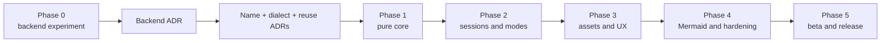

# ST4-Native Markdown Preview — Implementation Plan

## 1. Scope and inputs

| Field | Value |
| --- | --- |
| Status | Draft implementation plan |
| Date | 2026-08-27 |
| Product requirements | [`st4-native-redesign-prd.md`](st4-native-redesign-prd.md) |
| Detailed design | [`st4-native-redesign-design.md`](st4-native-redesign-design.md) |
| Target runtime | Sublime Text build 4200 stable/Python 3.8; CPython 3.14 CI and dev-build testing are non-blocking forward evidence |
| Delivery model | Independent package that coexists with `MarkdownLivePreview` |

This plan sequences the approved requirements and detailed design into reviewable
work packages. It does not reopen product requirements or duplicate interface
definitions from the detailed design. When this plan and the PRD disagree, the
PRD wins; when an implementation detail is absent here, the detailed design
governs.

The current repository is the reference implementation and migration source.
It is not the target orchestration architecture. In particular:

- Do not copy lifecycle or window-moving logic from `MarkdownLivePreview.py`.
- Reuse renderer behavior, fixtures, CSS, image parsing, and Mermaid URL encoding
  only after capturing the behavior in characterization tests.
- Preserve licenses and attribution for every retained dependency and asset.
- Do not modify or remove the current package while the new package must coexist
  with it.

## 2. Delivery strategy

Work proceeds by vertical risk reduction, not by module count:

1. Resolve the presentation feasibility risk before production code depends on
   a backend.
2. Stabilize pure contracts and renderer behavior before wiring Sublime events.
3. Prove lifecycle and latest-generation semantics with fakes before adding
   network callbacks.
4. Add assets and user-facing features only after session cleanup is reliable.
5. Run the required Linux matrix only after deterministic suites pass; defer
   macOS and Windows to future compatibility testing.

No calendar estimate is attached to a phase until its incoming gate passes.
Phase 0 can invalidate Candidate A by design; that result is progress, not a
schedule failure.

### 2.1 Decision gates

| Decision | Due | Required evidence | Blocks |
| --- | --- | --- | --- |
| Backend ADR | End of Phase 0 | Gate logs, screenshots, pixel measurements, OS/build records for both candidates | All production presentation code |
| Product/package name | Before Phase 1 package skeleton is merged | Package Control and GitHub collision search; command/settings/resource namespace | Package metadata and public identifiers |
| Markdown dialect/parser ADR | Before renderer implementation replaces characterization scaffolding | Fixture comparison, Python 3.8 and 3.14 import/tests, extension list, license and package-size review | `MarkdownEngine` production selection |
| Renderer reuse ADR | Early Phase 1 | Inventory of retained `markdown2html.py`, `lib/markdown2.py`, CSS, fixtures, and attribution | Destructive renderer refactors |
| Mermaid default/privacy decision | Before Phase 4 UX is frozen | Privacy review of first-use, settings, README, and install copy | Public default for `enable_mermaid` |
| Cache limits | Before Phase 3 cache merge | Memory-cost tests and 100 KiB/large-image fixtures | Production cache defaults |

## 3. Definition of done

A work package is complete only when:

- production code, focused automated tests, and required documentation land in
  the same change;
- pure layers pass under CPython 3.8 and 3.14 without importing `sublime`;
- all Sublime API access remains inside `adapter/` or `presentation/`;
- asynchronous results are marshalled to the UI thread and validated against a
  live session and its latest generation before changing UI state;
- error text and logs contain neither Markdown source nor unsafe asset locators;
- retained source/assets have license and attribution recorded; and
- relevant phase checks pass on the minimum supported build before the phase is
  declared complete.

Commits should be narrowly scoped to one work package or one independently
reviewable slice. Do not combine a state-model change with renderer migration or
network behavior unless the tests cannot express the boundary otherwise.

## 4. Phase 0 — Presentation backend decision

**Objective:** select exactly one backend through measured behavior. Production
renderer, assets, session orchestration, and final package naming are out of
scope.

### WP0.1 — Build the shared experiment harness

- Add `tests/fixtures/backend-scroll.md` with 200 numbered sections and the
  `SCROLL-ANCHOR-100` marker.
- Add a thin `PresentationBackend` experiment contract containing only
  `create`, `update`, `navigate`, `move`, `reveal`, `focus`, `close`,
  `is_alive`, `group_of`, `live_handles`, and `owner_of`.
- Add an in-ST command that runs deterministic backend contract assertions with
  no renderer or network dependency.
- Add gate scripts and JSON step logging under `docs/adr/phase0/`. Log Sublime
  build, OS, scaling, backend commit, command names observed by
  `on_post_window_command`, surface/session counts, and callback boundaries.
- Keep Phase 0 commands and contexts in a provisional `mdpreview_phase0_*`
  namespace so they cannot collide with either the current or final package.

**Verify:** both backend stubs run the same create/update/move/focus/close test;
the screenshot checkpoints occur after the fixed 500 ms settle interval.

### WP0.2 — Implement Candidate A experiment

- Create and update a native `HtmlSheet`; persist ownership in window settings.
- Test key contexts using `window.active_sheet()` while the `HtmlSheet` has
  focus.
- Test fragment navigation against a full, untruncated document and determine
  whether the TOC remains visible and usable while reading.
- Coalesce reconciliation to one zero-delay callback per window and record the
  close-family command generated by mouse close, keyboard close, group close,
  and window close.
- Do not add partial rendering, source navigation, periodic polling, undocumented
  callbacks, or a reduced TOC as workarounds.

**Verify:** execute all four gates from PRD §14 on Linux. macOS and Windows are
deferred future testing and do not block the backend decision.
Any missing close trigger or focused shortcut path is a failure, even if a later
safety-net event eventually cleans up.

### WP0.3 — Implement Candidate B control

- Wrap a scratch read-only `View` and one `PhantomSet` behind the same contract.
- Suppress view chrome and tag ownership in `view.settings()`.
- Implement navigation with heading position ratio and
  `layout_extent()`/`set_viewport_position()`.
- Use `on_pre_close` as the synchronous close trigger.

**Verify:** run the identical gate script, fixtures, window size, color scheme,
zoom, edit sequence, settle time, screenshots, and pixel measurement used for
Candidate A. Record navigation error for top, middle, and bottom headings.

### WP0.4 — Decide and clean up

- Publish `docs/adr/0001-presentation-backend.md` with the complete comparison
  table and links to evidence under `docs/adr/phase0/`.
- Reject Candidate A if any of scroll retention, full-document preview
  navigation with persistent TOC, close detection, or focused-preview mode
  switching fails.
- Record whether the selected navigation capability is `PROGRAMMATIC` or
  `FRAGMENT_ONLY` and therefore whether TOC is separate or inline.
- Remove the unselected prototype from the future release package. Retain only
  experiment evidence and backend contract tests.

**Phase 0 exit gate:** backend ADR approved; all four gates have explicit pass or
fail evidence for both candidates on Linux; selected-backend contract tests pass
on Linux. No Phase 1 production backend work starts earlier. macOS and Windows
evidence is future testing.

## 5. Phase 1 — Package skeleton and pure core

**Objective:** create the independent package, lock dependency decisions, and
produce deterministic offline minihtml through the selected backend.

### WP1.1 — Fix identity, metadata, and package boundaries

- Select the final product/package name and create the package directory,
  `.python-version` (`3.8`), `plugin.py`, unique command namespace, unique
  settings filename, keymaps, command palette entry, metadata, and license.
- Declare Package Control compatibility as `"sublime_text": ">=4200"`.
- Add CI jobs running the unit suite on CPython 3.8 and 3.14.
- Add the `preview/{adapter,application,domain,renderer,assets,presentation}`
  package tree and test directories from the detailed design §3.
- Add an import-boundary test that fails if `domain`, `renderer`, `assets`, or
  `application` imports `sublime`.
- Verify side-by-side installation with upstream `MarkdownLivePreview` at the
  namespace, module, settings, command, resource, and package-directory levels.

**Deliverables:** naming decision record, skeleton package, collision test, and
minimum-version metadata.

### WP1.2 — Implement domain contracts and settings

- Implement immutable `RenderRequest`, `PreviewDocument`, `Heading`, asset
  result types, diagnostics, `ThemeSnapshot`, and validated `RenderSettings`.
- Implement `SessionId` and random `ActionToken` generation without exposing
  source text or paths.
- Parse settings with type/range validation and fixed defaults; do not connect
  Sublime callbacks yet.
- Add tests for defaults, invalid values, clamping, frozen values, safe labels,
  and no-locator diagnostics.

**Deliverables:** pure contracts used by every later work package.

### WP1.3 — Characterize and select the Markdown engine

- Expand `tests/test_markdown2html.py` behavior into fixtures covering headings,
  paragraphs, emphasis, links, block quotes, fenced/inline code, lists, raw HTML,
  Unicode, malformed input, Mermaid fences, TOC thresholds, pre whitespace, and
  extensionless images.
- Run retained `markdown2` imports/tests on Python 3.8 (stable build 4200) and
  CPython 3.14 CI. A newest-dev integration run is optional.
- Publish the dialect/parser ADR with pinned extras, heading-id rules, retained
  dependency versions, licenses, and the decision on whether `bs4` remains.
- Record expected differences before changing any characterized output.

**Deliverables:** dialect ADR, fixture matrix, attribution inventory.

### WP1.4 — Build the structured renderer and sanitizer

- Implement `MarkdownEngine`, `parse()`, `StructuredDoc`, heading extraction,
  stable unique slugs, image/Mermaid references, TOC model, and pre/code fixes.
- Implement allowlisted minihtml serialization and URL handling. Source-provided
  `file:`, `subl:`, `javascript:`, unknown schemes, `style`, and `on*`
  attributes must not survive.
- Represent relative document links by opaque indices and plugin-generated
  action links by the session token.
- Keep `parse()` and `serialise()` pure. Use a fake resolver in the composed
  pipeline test; no real asset I/O belongs in this work package.
- Port `resources/stylesheet.css` as base CSS and implement fixed loading/error
  cards without theme or zoom callbacks.

**Verify:** fixture output, escaping, raw HTML sanitization, blocked links,
duplicate headings, and a test that secret Markdown/asset locator strings do not
appear in diagnostics or logs.

### WP1.5 — Promote the selected backend

- Implement the full `PresentationBackend` protocol selected by ADR 0001.
- Add ownership persistence across plugin reload and orphan cleanup using only
  proven-owned surfaces.
- Port the Phase 0 contract suite into `tests/contract/`; include the populated
  target-group case for `reveal()`.
- Delete or exclude all runtime code for the unselected backend.

**Verify:** real ST contract suite passes on stable build 4200; a newest-dev run
is useful forward evidence but is not a phase or release gate. An
unowned sheet/view is never closed during reconciliation.

### WP1.6 — Establish the benchmark baseline

- Commit `tests/fixtures/benchmark-100k.md` with no network dependencies.
- Measure 100 edits after warm-up from source-change receipt to backend update.
- Record CPU, OS, Sublime build, Python runtime, parser version, backend, warm-up
  count, p50, and p95.

**Phase 1 exit gate:** deterministic offline renderer tests pass, selected
backend contract smoke passes on real ST, dependencies import on Python 3.8 and 3.14,
and the benchmark report establishes the reference baseline.

## 6. Phase 2 — Session lifecycle and preview modes

**Objective:** make source/session/surface ownership correct before asynchronous
assets add more callbacks.

### WP2.1 — Wire application ports and lifecycle container

- Define `PresentationBackend`, `Clock`, `RunOnUi`, and `AssetResolverPort`
  protocols plus `SurfaceHandle`.
- Build the adapter-owned dependency container in `plugin_loaded()`.
- On unload, detach callbacks, close owned surfaces without layout restoration,
  invalidate sessions, and shut down executors with `wait=False`
  (`cancel_futures=True` added only when the interpreter is 3.9+).

### WP2.2 — Implement `PreviewSession` and `SessionManager`

- Add registries by session, `(window_id, source_buffer_id)`, and surface id.
- Implement the documented state transitions and validate
  `successful_generation <= completed_generation <= requested_generation`.
- Revalidate every stored id against live Sublime objects at adapter boundaries.
- Implement close causes and the preview/TOC/layout cleanup matrix.

**Verify:** open, repeat-open, focus, source close, preview close, TOC-only close,
window close, reload orphan, and unload transitions.

### WP2.3 — Implement the generation scheduler

- Snapshot source text, file/base path, settings, and theme on the UI thread
  after debounce.
- Permit at most one render future per session. New edits only advance
  `requested_generation`; after completion, dispatch the newest outstanding
  generation immediately.
- Advance `completed_generation` on success and failure; advance
  `successful_generation` only when a document is shown.
- Preserve the last successful content below a latest-generation error card.

**Verify with `FakeClock` and `ManualExecutor`:** latest-wins, never-lost,
latest-failure-without-loop, close-during-flight, edit-during-flight, and unload.

### WP2.4 — Implement layout ownership and modes

- Implement pure `split_cell()` and window-scoped `LayoutOwner` with exact
  fingerprints and holder sets.
- Test 1x1, two-column, two-row, 2x2, nested spans, and coincident-boundary
  fixtures before calling `window.set_layout()`.
- Implement Side-by-Side and Full Screen using the detailed design's strict
  order: move surfaces out, release groups right-to-left, then acquire/move and
  restore preview focus.
- Restore only when the final holder is gone, the group is empty, restoration
  is allowed for the close cause, and the current fingerprint still matches.
- Invalidate ownership after user layout changes; never overwrite the user's
  later layout.

**Verify:** no transition leaves an owned group empty, hides a separate TOC,
duplicates a surface, changes zoom, or closes/recreates the source.

### WP2.5 — Add commands, contexts, and events

- Add `WindowCommand`s for Side-by-Side, Full Screen toggle, zoom, reset, and
  relative-link/navigation actions.
- Implement `mdglance.preview_focused` and `mdglance.markdown_source` contexts
  from `window.active_sheet()` and Markdown scope.
- Marshal complete async event use cases to the UI thread before registry access.
- Observe edit, save, Save As/rename, syntax, source/surface close, window close,
  activation, layout commands, and plugin lifecycle.
- Fail safely when source or surface disappears after command enablement.

**Phase 2 exit gate:** the PRD §12.2 lifecycle matrix passes with fake adapters;
real ST smoke covers both modes, all close orders, populated groups, saved and
unsaved buffers, and plugin reload. The source sheet is never closed or recreated.

## 7. Phase 3 — Assets, styling, TOC, and zoom

**Objective:** complete all offline features and add bounded remote image
handling without weakening session/generation guarantees.

### WP3.1 — Implement local asset resolution

- Canonicalize local paths independently from remote URLs; saved sources resolve
  from their directory, while untitled sources use the first project folder or
  no filesystem base.
- Read local files outside locks with byte caps; sniff PNG/JPEG/GIF headers and
  dimensions before embedding.
- Port `get_image_size()` behavior and extensionless-image fixtures.
- Return stable placeholders for missing, unreadable, unsupported, and oversized
  files without failing the document.

### WP3.2 — Implement remote fetch, policy, and cache

- Use a four-worker network executor separate from the two-worker render
  executor; perform no network work on the UI thread or under resolver locks.
- Enforce HTTPS by default, verified TLS, connect/read timeout, five redirects,
  no HTTPS-to-HTTP downgrade without opt-in, streaming byte limit, and decoded
  dimension limit.
- Implement the 64 MiB bounded in-memory LRU and 30-second negative TTL, subject
  to the cache-limit decision. Count `cache_cost_bytes`, not response bytes.
- Deduplicate requests by canonical `AssetKey`; maintain waiter sets by session.
- On policy revision, discard or reclassify stale completions, resubmit only
  still-permitted work, and wake every waiter exactly once.
- Log only `AssetKey.safe_label`; never log Mermaid locators.

**Verify:** concurrent dedup, timeout, redirect downgrade, declared/streamed size,
dimension rejection, negative expiry, eviction, forgotten waiter, policy changes
during fetch, tighten/loosen cache hits, and callback after close.

### WP3.3 — Connect assets to generation scheduling

- Compose `parse → resolver.resolve → serialise` in
  `application/render_pipeline.py`.
- Derive `pending_assets` only from resolver results.
- On completion, rerender only live sessions still waiting for the key; normal
  generation checks remain the final apply guard.
- Ensure a failed asset changes only its placeholder and never fails the full
  document.

### WP3.4 — Add theme-aware presentation and zoom

- Build `ThemeSnapshot` from the source view and observe color-scheme changes.
- Assemble minihtml with base CSS, explicit theme colors/variables, and a root
  font-size from 50% to 300% in 10% steps.
- Keep `PreviewDocument.body_html` zoom-independent; `represent()` must not
  parse Markdown or resolve/refetch assets.
- Verify `rem`, `max-width`, and image aspect-ratio behavior on both supported
  builds; apply the documented width-only fallback if `height: auto` fails.

### WP3.5 — Add TOC and settings callbacks

- Enforce both length and heading-count thresholds and preserve `h1`–`h6`
  hierarchy, duplicate-heading identity, active entry, and active ancestors.
- Implement the ADR-selected inline or separate TOC form. Separate TOC links
  use validated opaque tokens; inline TOC uses valid same-document fragments.
- Register settings and color-scheme callbacks and remove them on source close or
  unload. Classify changes into no-render, `represent()`, render, and policy
  revision paths.
- Re-resolve the base path after Save As without recreating the preview.

**Phase 3 exit gate:** with networking disabled, Markdown, local images, theme,
TOC, zoom, saved/unsaved buffers, and both preview modes work. Remote asset
callbacks cannot update a closed session or supersede a newer generation.

## 8. Phase 4 — Mermaid, diagnostics, and hardening

**Objective:** complete the public P0 feature set and security/reliability gates.

### WP4.1 — Add Mermaid diagram support

- Reuse the characterized Mermaid request encoding in `assets/mermaid.py` and
  send it through the same resolver, policy, fetcher, cache, limits, and stale
  completion path as remote images.
- When disabled or unavailable, retain the original fenced source as code.
- Add one first-pending privacy notice per session and consistent disclosure in
  settings, README, install message, and error/loading UI.
- Apply the privacy decision to the shipped default; do not describe the feature
  as offline, built-in JavaScript, WebView, or browser rendering.

### WP4.2 — Add diagnostics and safe logging

- Implement `Copy Diagnostics` with package version, Sublime build, platform,
  Python runtime, sanitized settings, and recent fixed stage names.
- Exclude Markdown, credentials, full URLs, query strings, paths, response
  bodies, and Mermaid locators by default. Debug mode may expose remote image
  locators only, never Mermaid locators.
- Add tests that seed recognizable secrets in every excluded field and assert
  they are absent from clipboard text, logs, placeholders, and error cards.

### WP4.3 — Failure injection and performance

- Inject parser, structure, serialization, executor, local I/O, DNS/TLS,
  redirect, timeout, oversized-response, invalid-image, stale-policy, and unload
  failures.
- Confirm every worker exception becomes a typed failure and later edits retry
  normally without reopening the preview.
- Rerun the 100 KiB benchmark. Investigate and explain any p95 regression above
  20% from the Phase 1 baseline; retain p95 under 250 ms as the reference-machine
  target, not a cross-machine release gate.
- Check long previews for phantom flicker/chrome/selection issues if Candidate B
  was selected.

### WP4.4 — Required release matrix

- Run Linux on stable build 4200/Python 3.8 as the release gate. Keep CPython
  3.14 CI and newest-dev integration testing as non-blocking forward evidence.
  Defer macOS and Windows to future compatibility testing.
- Cover default light/dark plus one third-party color scheme; saved, unsaved,
  Save As, renamed, and deleted files; short/100 KiB/Unicode/malformed/raw HTML;
  image and Mermaid policy/failure cases; TOC hierarchy/navigation; and every
  lifecycle close order from PRD §12.4.
- Store results in `docs/manual-test-plan.md` with build/OS evidence and defect
  links. Rerun the affected row after every fix.

**Phase 4 exit gate:** all P0 requirements and security/privacy checks pass; the
complete manual matrix has evidence; no known P0 defect remains.

## 9. Phase 5 — Beta and release

### WP5.1 — Package completeness review

- Confirm final name consistency across directory, commands, settings, resources,
  metadata, README, install message, privacy copy, diagnostics, and screenshots.
- Verify license and attribution for vendored code, CSS, images, and fixtures.
- Verify only the selected backend ships and Package Control metadata enforces
  build 4200+.
- Document old-to-new settings mapping and the Side-by-Side behavior change. Do
  not add automatic migration unless its open decision is separately approved.

### WP5.2 — Prerelease

- Publish a SemVer prerelease under the independent identity.
- Test installation, upgrade, disable/enable, reload, uninstall, and coexistence
  with upstream `MarkdownLivePreview`.
- Collect only sanitized diagnostics. Triage lifecycle, compatibility, security,
  and data-disclosure reports as release blockers when they affect P0.

### WP5.3 — Public release

- Fix all P0 beta defects and rerun the affected automated and manual matrices.
- Tag the release, publish release notes and migration guidance, and submit the
  independent package to Package Control.
- Preserve Phase 0 evidence, ADRs, benchmark reports, and manual-test results as
  release artifacts.

**Phase 5 exit gate:** every PRD §15 acceptance criterion is checked with a link
to test output, ADR, metadata, documentation, or manual evidence.

## 10. Requirement traceability

| Requirement area | Primary work packages | Release evidence |
| --- | --- | --- |
| FR-001–003 commands and modes | WP0.1–0.4, WP2.4–2.5 | Backend ADR, contract suite, lifecycle matrix |
| FR-010–012 live rendering/errors | WP2.2–2.3 | Scheduler state tests, error-card tests |
| FR-020–021 Markdown/styling | WP1.3–1.4, WP3.4 | Dialect ADR, fixtures, theme matrix |
| FR-030–031 images | WP3.1–3.3 | Resolver/fetch/cache tests, manual image matrix |
| FR-040 Mermaid | WP4.1 | Privacy copy review, enabled/disabled/offline tests |
| FR-050 TOC | WP0.2–0.4, WP3.5 | Backend gate, hierarchy/navigation tests |
| FR-060–061 zoom/links | WP1.4, WP2.5, WP3.4–3.5 | Sanitizer, token, zoom/no-reparse tests |
| FR-070 settings | WP1.2, WP3.5 | Validation/change-classification/callback-cleanup tests |
| FR-071 diagnostics | WP4.2 | Secret-exclusion tests |
| Security/privacy/reliability | WP1.4, WP2.3, WP3.2–3.3, WP4.1–4.3 | Sanitizer, failure injection, safe-log tests |
| Compatibility/release | WP1.1, WP1.5–1.6, WP4.4, WP5.1–5.3 | Required Linux build matrix and Package Control metadata; macOS/Windows deferred |

## 11. Execution checklist

Use this list as the phase-level tracker; detailed task status belongs in the
issue tracker rather than in this design document.

- [ ] Phase 0 evidence complete and backend ADR approved.
- [ ] Product/package name selected and collision-checked.
- [ ] Markdown dialect/parser and renderer reuse ADRs approved.
- [ ] Phase 1 pure-core, selected-backend, and benchmark gate passed.
- [ ] Phase 2 lifecycle and preview-mode gate passed.
- [ ] Cache limits and Mermaid default/privacy decisions recorded.
- [ ] Phase 3 offline-feature and asset-generation gate passed.
- [ ] Phase 4 P0, security/privacy, performance, and required Linux matrix passed.
- [ ] Phase 5 package-completeness, coexistence, beta, and release gates passed.
