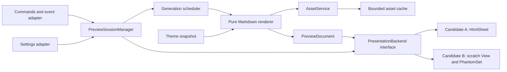
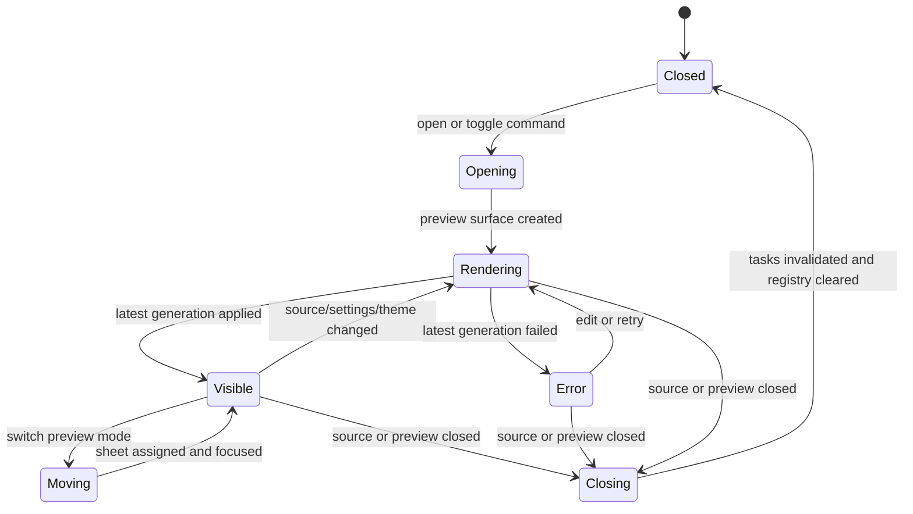
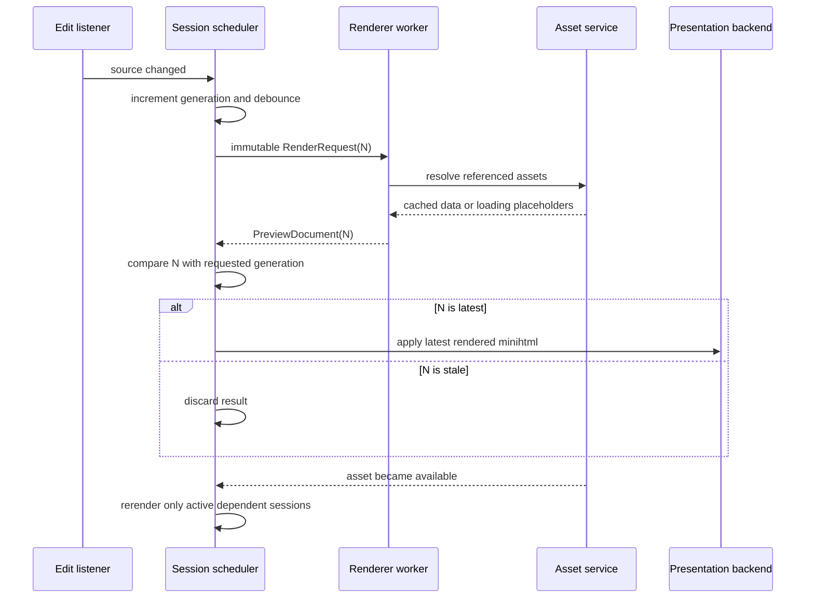

# ST4-Native Markdown Preview Redesign PRD

## 中文摘要

- 本项目将从零实现 ST4 orchestration 和 session model；现有 renderer、image logic、tests 与 fixtures 作为可继承并重构的资产，不做无收益的 clean-room rewrite（见 [2. Product decision](#2-product-decision)）。
- presentation backend 尚未决定。Phase 0 将比较 Candidate A `HtmlSheet` 与 Candidate B scratch `View` + `PhantomSet`；若 `HtmlSheet` 无法同时满足 live update scroll retention 和 TOC navigation，则 Candidate A 整体淘汰，不做功能降级式 fallback（见 [7. Proposed architecture and backend decision](#7-proposed-architecture-and-backend-decision) 与 [14. Delivery plan](#14-delivery-plan)）。
- 首个正式版本保留 Side-by-Side、Full Screen、live update、theme-aware styling、remote/local images、TOC、zoom 和 Mermaid；Mermaid 默认仍通过 remote service render，不宣称 offline 或内置 JavaScript rendering（见 [6. Functional requirements](#6-functional-requirements)）。
- 目标 host 为当前 stable build 4200（Python 3.8 runtime），`.python-version` 使用 `3.8`；代码按 Python 3.8 兼容编写，同时主动在 dev build 4205+ 的 Python 3.14 runtime（当前 dev 4207，4206 起为 3.14.6）上测试，保证升级后无需改动（见 [11. Compatibility and dependencies](#11-compatibility-and-dependencies)）。
- Phase 0 是 backend 决策实验，不是对 `HtmlSheet` 路线的单向验证；其结果必须形成 ADR 后才能开始 production presentation code（见 [14. Delivery plan](#14-delivery-plan)）。
- 现有主要结构性问题位于 `MarkdownLivePreview.py` 的 window/view lifecycle、全局 mutable registries 和 layout restoration，以及 `markdown2html.py` 的 render、network、image cache 与 HTML post-processing 耦合（见 [3. Problem statement](#3-problem-statement)）。

## 1. Document status

| Field | Value |
| --- | --- |
| Status | Draft for product and architecture review |
| Date | 2026-08-27 |
| Product | Independent ST4-native Markdown preview package |
| Target | Sublime Text 4 |
| Implementation strategy | Rewrite orchestration; refactor and selectively reuse renderer assets |
| Primary artifact | A new package that can eventually replace this fork without sharing runtime identity |

## 2. Product decision

The project will implement its Sublime Text orchestration, session model,
presentation abstraction, concurrency model, and command namespace from scratch.
The current repository remains the implementation reference for renderer and
image behavior as well as the source of regression tests and fixtures.

The implementation boundary is:

- New package identity, module layout, command namespace, settings filename and
  schema, session model, render pipeline, and tests.
- No copying of orchestration functions or lifecycle logic from
  `MarkdownLivePreview.py`.
- Existing `markdown2html.py`, `lib/markdown2.py`, renderer tests, CSS, image
  fixtures, and parsing edge cases may be reused or incrementally refactored
  under their existing MIT licensing and attribution.
- Before a reused behavior is changed, capture it in a characterization test so
  the change is deliberate rather than accidental.
- Third-party Markdown libraries may be used. Reimplementing the Markdown
  grammar is not a product goal.
- Any retained third-party source, fixture, CSS fragment, or asset must keep its
  original license and attribution.
- Git history and the MIT license remain available for provenance even when the
  new package lives in a new repository.

The final product name is intentionally undecided. `Markdown Preview Enhanced`
must not be used because that name already identifies an unrelated Atom/VS Code
project. The selected name must be unique in Package Control and must become the
package directory name.

## 3. Problem statement

The current package was designed around Sublime Text 3-era APIs. Its preview is
implemented by creating scratch text views, inserting block phantoms, moving or
recreating source views, opening a second window for side-by-side mode, and
manually restoring layouts when preview or TOC views close.

This creates four classes of problem:

1. **Lifecycle fragility.** Source views, preview views, windows, phantom sets,
   and TOC panes are tracked through settings and module-level dictionaries.
   Closing tabs or windows in an unexpected order can leave stale references or
   restore an obsolete layout.
2. **Rendering coupling.** Markdown conversion, HTML transformation, image
   fetching, image inspection, caching, placeholder generation, and rerender
   callbacks are combined in `markdown2html.py`.
3. **Concurrency ambiguity.** Multiple delayed renders and image callbacks can
   complete out of order. There is no explicit render generation or cancellation
   model.
4. **ST4 alternatives are unevaluated.** Sublime Text 4 provides `Sheet`,
   `HtmlSheet`, `Window.new_html_sheet()`, `HtmlSheet.set_contents()`, modern
   link protocols, and a Python 3.8 runtime. The package still models a preview
   as editable text plus a phantom, but the newer API has not yet been proven to
   preserve the scroll and navigation behavior required by this product.

The redesign must make the lifecycle predictable before adding more renderer
features.

## 4. Goals and success measures

### 4.1 Goals

- Provide a native-feeling live Markdown preview in a Sublime Text editor group.
- Support same-window Side-by-Side and Full Screen preview modes.
- Keep preview sessions correctly attached to their source buffers across edits,
  saves, renames, group moves, and ordinary tab closure.
- Preserve the currently enhanced user-visible feature set: theme-aware styling,
  Mermaid, automatic TOC, zoom, and local/remote images.
- Keep Sublime-specific code and the selected presentation backend out of the
  renderer and network services.
- Make stale asynchronous work unable to overwrite newer output.
- Make privacy-sensitive network behavior explicit and configurable.
- Establish automated unit and state-model tests plus repeatable ST4 smoke tests.
- Prepare a package identity that can coexist with the upstream
  `MarkdownLivePreview` package during migration.

### 4.2 Success measures

| Measure | Target |
| --- | --- |
| Local text update latency | Record p50/p95 on the committed 100 KiB benchmark fixture; p95 under 250 ms is an initial reference-machine target, not a cross-machine release gate |
| UI blocking during network access | 0 network calls on the UI thread |
| Stale render replacement | 0 older generations applied after a newer generation |
| Session cleanup | 100% of closed preview/source sessions removed from the registry |
| Offline baseline | Plain Markdown, local images, TOC, styling, and zoom remain usable without network |
| Automated coverage | Required renderer fixture matrix and every enumerated session transition pass; core coverage is reported, not used as a substitute for behavior tests |
| Supported platforms | Linux, macOS, and Windows on the declared minimum ST4 build |
| Manual release gate | Saved/unsaved buffers, both preview modes, light/dark schemes, images, TOC, and Mermaid checked |

The performance fixture is committed as `tests/fixtures/benchmark-100k.md`. It
contains headings, paragraphs, nested lists, fenced code, links, TOC-triggering
content, and cached local images, but no network requests. A benchmark report
records CPU model, OS, Sublime build, Python runtime, parser version, backend,
warm-up count, and 100 measured edits. Latency is measured from receipt of the
source-change event to the presentation update call. The first Phase 1 report
defines the reference machine and baseline; later releases must explain a
regression greater than 20% in p95.

## 5. Non-goals

- A Chromium/WebView-based preview.
- Running arbitrary JavaScript inside the preview.
- Full browser CSS compatibility; output remains constrained by minihtml.
- Implementing a Markdown parser from scratch.
- Editing Markdown inside the preview.
- Export to PDF or standalone HTML in the first release.
- MathJax, executable code blocks, presentation mode, wikilinks, or notebook
  semantics in the first release.
- Automatic migration of every upstream setting or undocumented behavior.
- Supporting Sublime Text 3.

## 6. Functional requirements

Priority meanings: **P0** is required for the first public release, **P1** may
ship in the first release if it does not threaten P0, and **P2** is deferred.

### 6.1 Preview commands and modes

#### FR-001 — Open Side-by-Side Preview (P0)

The user can invoke a command from a Markdown source sheet to open or focus its
preview in a group to the right of the source.

Acceptance criteria:

- Default shortcuts are `Ctrl+K, V` on Windows/Linux and `Cmd+K, V` on macOS.
- The source stays in its current window and remains editable.
- If no right-hand group exists, the plugin creates one without moving unrelated
  sheets.
- Repeating the command focuses the existing preview instead of creating a
  duplicate.
- One source buffer has at most one live preview session per window.
- Closing a plugin-created preview group restores the prior layout only when the
  user has not subsequently changed that layout, and restoration completes
  within one UI callback after the close action.

#### FR-002 — Toggle Full Screen Preview (P0)

The user can toggle a preview sheet in the same group as the source.

Acceptance criteria:

- Default shortcuts are `Ctrl+Shift+V` on Windows/Linux and `Cmd+Shift+V` on
  macOS.
- “Full Screen” means the preview occupies the source editor group; it does not
  toggle Sublime Text or operating-system full-screen mode.
- Toggling from the preview closes or hides it and focuses the source sheet.
- A session can move between Side-by-Side and Full Screen without creating a
  second renderer or losing zoom state.

#### FR-003 — Command availability (P0)

- Preview commands are enabled for Markdown syntax, including compatible syntax
  packages whose base scope is Markdown.
- Preview-specific commands are enabled when focus is in an owned preview or TOC
  sheet.
- Commands fail safely if the source or preview was closed between enablement and
  execution.
- User-initiated closure of the selected presentation surface is detected and
  reconciled. Candidate A must solve the absence of documented `HtmlSheet` close
  events without relying on an undocumented callback; Candidate B may use
  documented `View` lifecycle events.

### 6.2 Live rendering

#### FR-010 — Debounced live update (P0)

- An edit schedules a render after `update_delay_ms`, defaulting to 100 ms.
- A newer edit supersedes an older pending render.
- The renderer receives an immutable snapshot of source text, source location,
  settings, and theme inputs; width constraints are applied by the stylesheet,
  so a group resize does not require a rerender.
- Only the latest generation may update its presentation surface.
- Saving, renaming, or changing the syntax triggers a fresh render when relevant.

#### FR-011 — Saved and unsaved buffers (P0)

- Untitled Markdown buffers can be previewed.
- Relative assets in untitled buffers resolve against an explicitly documented
  fallback: the first project folder, otherwise no filesystem base.
- After Save As, relative assets resolve against the new file directory without
  reopening the preview.

#### FR-012 — Error state (P0)

- A render failure produces a readable in-preview error card while preserving
  the last successful content when possible.
- Error output identifies the failed stage but never includes full document
  contents, credentials, or response bodies.
- A later edit retries normally; users do not need to reopen the preview.

### 6.3 Markdown and styling

#### FR-020 — Markdown conversion (P0)

- Support headings, paragraphs, emphasis, links, block quotes, fenced code,
  inline code, lists, and images at minimum.
- Define the exact Markdown dialect in an Architecture Decision Record before
  implementation begins.
- Sanitize or escape raw content so source Markdown cannot invoke arbitrary
  Sublime commands through generated `subl:` URLs.
- Unsupported minihtml elements must degrade into readable content.

#### FR-021 — Theme-aware stylesheet (P0)

- Use documented minihtml variables such as `--background`, `--foreground`, and
  scheme-derived colors.
- Remain readable in light and dark color schemes.
- Style headings, body text, links, block quotes, lists, inline code, fenced code,
  images, error cards, loading states, and TOC entries.
- A color scheme change rerenders all visible previews without reopening them.
- Custom CSS is P2 and must not delay the first release.

### 6.4 Images

#### FR-030 — Local images (P0)

- Resolve relative paths from the saved source file directory.
- Support minihtml-compatible PNG, JPEG, and GIF data.
- Preserve intrinsic aspect ratio and constrain oversized images to the preview
  width.
- Missing, unreadable, or unsupported images show a stable placeholder with an
  actionable reason.
- Path normalization must prevent accidental interpretation of remote URLs as
  local paths.

#### FR-031 — Remote images (P0)

- Fetch remote images asynchronously with explicit connect/read timeouts.
- Permit only `https` by default; `http` requires an opt-in setting.
- Enforce configurable response-size and decoded-dimension limits.
- Cache successful results by canonical URL and cache failures briefly to avoid a
  request loop.
- Never log URL query strings unless debug logging explicitly enables them.
- A completed request triggers a new generation only if an active session still
  references that asset.

### 6.5 Mermaid

#### FR-040 — Mermaid fenced blocks (P0)

- A fenced block labelled `mermaid` renders as a diagram when Mermaid is enabled.
- The first release may send diagram source to a configurable HTTPS rendering
  service and display the returned PNG.
- Default service behavior and the fact that source leaves the machine must be
  stated in settings, README, install message, and the first error/loading state.
- When disabled or offline, the original Mermaid source remains visible as code.
- Requests use the same timeout, cache, size, privacy, and stale-generation rules
  as remote images.
- The product must call this “Mermaid diagram support”, not “offline” or
  “built-in Mermaid rendering”.

#### FR-041 — Offline Mermaid renderer (P2)

An offline renderer may be added only after a separate dependency, package-size,
security, and cross-platform ADR. It is not implied by the initial architecture.

### 6.6 Table of contents

#### FR-050 — Automatic TOC (P0)

- Show TOC only when both `toc_minimum_length` and
  `toc_minimum_headings` thresholds are met; defaults are 1,200 and 3.
- Preserve heading hierarchy from `h1` through `h6`.
- Selecting an entry navigates the preview to the corresponding heading.
- The active entry and ancestors are visually distinct when the platform exposes
  sufficient navigation state.
- TOC presentation is read-only and may use a separate surface or an in-preview
  navigation area, provided it remains visible and usable while reading.
- Phase 0 must prove that the selected backend can navigate the preview itself;
  navigating only the source is not an acceptable replacement for this P0
  requirement.
- Candidate A must preserve live-update scroll and implement preview navigation.
  If either cannot be demonstrated with documented API behavior, Candidate A is
  rejected as a whole for the first release and Candidate B is selected.
- The implementation must not assume a browser DOM or JavaScript scroll API.

### 6.7 Zoom and navigation

#### FR-060 — Preview zoom (P0)

- Keyboard and mouse-wheel controls adjust root font scale from 50% to 300% in
  10% increments.
- Zoom is stored per preview session and survives mode changes.
- `Reset Preview Zoom` restores 100%.
- Zoom changes do not reparse Markdown or refetch assets; they only regenerate
  presentation HTML or CSS.

#### FR-061 — Links (P0)

- `https` links open in the system browser through documented minihtml behavior.
- Relative document links resolve against the source location.
- `file`, `subl`, and unknown schemes from Markdown source are blocked by default.
- Plugin-generated command links carry opaque identifiers, not source text or
  filesystem paths.

### 6.8 Settings and diagnostics

#### FR-070 — Settings (P0)

The first release exposes:

```json
{
    "update_delay_ms": 100,
    "enable_mermaid": true,
    "mermaid_server": "https://mermaid.ink",
    "allow_insecure_remote_images": false,
    "remote_timeout_seconds": 15,
    "remote_max_bytes": 10485760,
    "remote_max_dimension": 4096,
    "toc_minimum_length": 1200,
    "toc_minimum_headings": 3,
    "debug_logging": false
}
```

- Settings changes are observed with `Settings.add_on_change()`.
- Changes rerender affected sessions without a plugin reload.
- Network-policy changes cancel or invalidate incompatible in-flight requests.

#### FR-071 — Diagnostics (P1)

- A `Markdown Preview: Copy Diagnostics` command copies package version,
  Sublime build, platform, Python runtime, active settings with secrets removed,
  and recent stage names.
- Diagnostics never include Markdown contents or full remote URLs by default.

## 7. Proposed architecture and backend decision

### 7.1 Component boundaries



The package is divided into:

- **Sublime adapter:** commands, event listeners, sheet creation, focus, groups,
  settings, and plugin lifecycle.
- **Application layer:** session ownership, state transitions, generation
  scheduling, and use cases.
- **Renderer:** Markdown AST/HTML conversion into a structured immutable result.
- **Asset service:** URL/path normalization, policy, asynchronous fetching,
  validation, and caching.
- **Presentation backend:** ownership, update, navigation, scroll, focus, zoom,
  and closure operations behind a small interface. Phase 0 selects exactly one
  production backend for the first release.

No renderer or asset module may import `sublime` or `sublime_plugin`.

### 7.2 Presentation backend candidates

#### Candidate A — `HtmlSheet`

Use `Window.new_html_sheet()` and `HtmlSheet.set_contents()` to represent the
preview as a native HTML sheet.

Advantages:

- Direct ST4 abstraction for read-only minihtml content.
- No fake text buffer, caret, gutter, or phantom reservation region.
- Small update API and natural tab identity.

Known constraints:

- `HtmlSheet` exposes content replacement but no documented scroll-position API.
- minihtml documents no browser DOM or JavaScript navigation mechanism.
- documented `View` lifecycle events do not apply to an HTML sheet.
- an HTML sheet has no `Settings` object for a key binding context. Candidate A
  must route preview key contexts through `EventListener.on_query_context()` and
  identify ownership with `window.active_sheet()`. Phase 0 must prove that toggle
  shortcuts dispatch while the HTML sheet has focus; otherwise the mode-switch
  gate fails.
- Phase 0 treats live-update scroll retention, heading navigation,
  user-initiated close detection, and focused-preview mode switching as four
  hard backend gates, not isolated features that may silently degrade.

Candidate A is rejected for the first release if any hard gate cannot be
demonstrated through documented or explicitly measured API behavior.

Candidate A may reconcile ownership against `Window.sheets()` after these
documented or observable triggers:

- every plugin `WindowCommand`, before it acts;
- `on_activated`, `on_modified_async`, and `on_pre_close` for an owned source;
- `on_post_window_command` after close, move, or layout commands; and
- `on_pre_close_window`.

“Bounded reconciliation” means at most one zero-delay reconciliation callback is
pending per window and no periodic timer is used. For the close-detection gate,
the close action itself must produce a usable trigger: session cleanup and any
plugin-owned layout restoration complete within one UI callback after that
trigger, before another user action is required. The remaining triggers are
safety nets, not permission for visibly delayed restoration. If mouse, keyboard,
group, or window closure produces no such trigger, Candidate A fails the gate.

#### Candidate B — scratch `View` with `PhantomSet`

Use a read-only scratch text `View` as the preview surface and render the complete
document through one block phantom. This is the same presentation primitive as
the current package, but it is wrapped in the new session, scheduler, and backend
interfaces; the current window-moving lifecycle code is not retained.

Advantages:

- Documented viewport and `View` lifecycle APIs support scroll, navigation,
  close detection, and focus.
- Existing behavior demonstrates feasibility for images, TOC navigation, zoom,
  and live phantom replacement.
- Can satisfy P0 without depending on browser behavior absent from minihtml.

Costs:

- Requires deliberate suppression of editable-view chrome and interaction.
- Retains phantom-specific layout, size, and rendering constraints.
- Needs regression tests for caret, selection, gutter, word wrap, very large
  previews, and phantom update flicker.

Candidate B is the default fallback and becomes the selected first-release
backend if Candidate A fails any hard gate. Because the current implementation
already demonstrates its core feasibility, its Phase 0 prototype is only a thin
wrapper over the backend contract for comparison; it does not rebuild renderer,
image, theme, or zoom behavior. Selecting B does not authorize reuse of the
current orchestration or cross-window source-moving code.

#### Decision record

Phase 0 produces an ADR with the same fixture and interaction script run against
both candidates. The decision table must include:

| Criterion | Required result |
| --- | --- |
| Live update at mid-document scroll | No jump to document start; reading position remains usable |
| TOC navigation | Preview moves to the selected heading |
| User closes preview | Session cleanup and eligible layout restoration finish within one UI callback after close, without another user action |
| Side-by-Side / Full Screen switch | Focused-preview shortcut works; one session and one preview surface remain (plus at most one TOC surface when the TOC is a separate sheet) |

#### Scroll-retention experiment protocol

`HtmlSheet` does not expose a scroll-position getter, so the decision uses a
repeatable black-box visual measurement:

1. Use `tests/fixtures/backend-scroll.md`, containing 200 numbered sections and
   a uniquely styled `SCROLL-ANCHOR-100` marker.
2. Fix the Sublime window at 1280 × 900 logical pixels, use the default dark
   color scheme, 100% preview zoom, and hide the minimap and sidebar.
3. Scroll until the marker's top edge is one third of the preview viewport from
   the top, then capture the baseline screenshot.
4. Apply ten predefined edits in a paragraph after the anchor. For each edit,
   observe the backend presentation-update call return, wait exactly 500 ms, and
   capture another screenshot. “Settled” means this fixed 500 ms interval; the
   tester must not substitute a subjective visual wait.
5. Record Sublime build, OS scaling, backend commit, and the eleven screenshots
   in the ADR. Measure the marker's vertical pixel coordinate in each image.

Pass condition: the anchor remains visible after every update, never jumps to the
document top, and its settled vertical position differs from baseline by no more
than one rendered line height. Run the identical protocol against Candidate B as
the control. Screen recording may supplement the screenshots but does not replace
the stored measurements.

### 7.3 Proposed package layout

```text
<PackageName>/
├── .python-version
├── plugin.py
├── Default (Linux).sublime-keymap
├── Default (OSX).sublime-keymap
├── Default (Windows).sublime-keymap
├── Default.sublime-commands
├── <PackageName>.sublime-settings
├── preview/
│   ├── application/
│   │   ├── commands.py
│   │   ├── scheduler.py
│   │   ├── session.py
│   │   └── session_manager.py
│   ├── domain/
│   │   ├── document.py
│   │   ├── heading.py
│   │   ├── render_request.py
│   │   └── settings.py
│   ├── infrastructure/
│   │   ├── assets.py
│   │   ├── cache.py
│   │   ├── markdown_engine.py
│   │   └── sublime_adapter.py
│   └── presentation/
│       ├── backend.py
│       ├── html_sheet.py
│       ├── phantom_view.py
│       ├── minihtml.py
│       └── stylesheet.py
├── resources/
│   └── preview.css
├── tests/
│   ├── unit/
│   ├── state/
│   └── fixtures/
└── docs/
    ├── architecture.md
    └── manual-test-plan.md
```

The exact package name replaces `<PackageName>` after the naming decision. The
unselected backend prototype is removed from the release package after the ADR;
the interface and its contract tests remain.

### 7.4 Core data contracts

Illustrative contracts, not final code:

```python
@dataclass(frozen=True)
class RenderRequest:
    session_id: str
    generation: int
    markdown: str
    base_path: Optional[str]
    zoom: float
    settings: RenderSettings
    theme: ThemeSnapshot


@dataclass(frozen=True)
class PreviewDocument:
    body_html: str
    headings: tuple[Heading, ...]
    asset_dependencies: tuple[AssetKey, ...]
    diagnostics: tuple[RenderDiagnostic, ...]


@dataclass
class PreviewSession:
    id: str
    window_id: int
    source_buffer_id: int
    source_sheet_id: int
    preview_surface_id: Optional[int]
    toc_surface_id: Optional[int]
    backend: PresentationBackendKind
    mode: PreviewMode
    zoom: float
    requested_generation: int      # bumped on every render request
    completed_generation: int      # last generation whose result (success or failure) was processed
    successful_generation: int     # last generation that produced a document and was shown
```

IDs are validated against live Sublime objects at every API boundary. The
session registry must not treat an integer ID as proof that an object still
exists.

## 8. Session state model



Required invariants:

- A session owns zero or one preview surface and zero or one TOC surface through
  the selected backend.
- `successful_generation <= completed_generation <= requested_generation`.
- Only output whose generation equals `requested_generation` can be applied.
- At most one render is in flight per session; when it completes,
  `completed_generation` advances whether it succeeded or failed, and a newer
  requested generation is dispatched immediately. A failing latest generation
  is therefore rendered once, not retried in a loop.
- Closing a source invalidates all pending work before closing owned presentation
  surfaces.
- Closing a preview removes the session without closing or recreating the source.
- `plugin_unloaded()` removes settings callbacks, invalidates sessions, and shuts
  down owned executors without waiting indefinitely.
- Layout restoration occurs only if the current layout still matches the exact
  layout last written by the plugin.

## 9. Render and asset pipeline



The worker pool is bounded. Markdown rendering and network work use separate
executors so slow servers cannot consume all render capacity. Queue depth and
cache limits must be explicit constants or settings.

## 10. Security, privacy, and reliability

### 10.1 Content safety

- Escape all source-derived text before it enters HTML.
- Allowlist emitted tags, attributes, CSS properties, and URL schemes.
- Never pass a source-provided `subl:` link to minihtml.
- Plugin action links contain random session/action tokens validated by the
  command handler.
- Do not execute code blocks, HTML scripts, or external commands.

### 10.2 Network safety

- Network access is restricted to image and explicitly enabled Mermaid requests.
- HTTPS certificate verification remains enabled.
- Redirects are bounded and must not transition from HTTPS to HTTP unless the
  insecure setting is enabled.
- Responses are rejected before full buffering when `Content-Length` exceeds the
  limit, and streaming stops when the actual byte limit is crossed.
- Image headers and dimensions are validated before embedding data.
- Remote results are cached in memory initially; persistent cache is P2.

### 10.3 Failure isolation

- Exceptions crossing a worker boundary become typed failures.
- A failed asset does not fail the complete document render.
- Closing a session makes later callbacks no-ops.
- The plugin never closes a source sheet or window as part of preview cleanup.

## 11. Compatibility and dependencies

### 11.1 Baseline

**Target host: Sublime Text build 4200 (current stable). Python baseline: 3.8.
Code is written to be Python 3.8-compatible and is actively tested on Python
3.14 so that it runs cleanly on build 4205+ without change.**

Situation at the time of this PRD:

- Stable: build 4200, Python 3.8 plugin host.
- Dev: build 4205 replaced the Python 3.8 host with Python 3.14; dev builds
  are at 4207, and 4206 onward use Python 3.14.6. The API Environments
  documentation states that `.python-version` value `3.8` selects the Python
  3.14 host on these builds for backwards compatibility.

Therefore:

- `.python-version` contains `3.8`;
- production source uses only syntax and stdlib available in Python 3.8
  (no PEP 604 unions, no builtin generics in annotations, no `match`, no
  `dataclass(slots=True)`); typing uses `typing.Optional`/`Tuple`/`Dict`;
- production source must also run unchanged on Python 3.14: no reliance on
  APIs removed between 3.8 and 3.14 (`distutils`, `imp`, `asynchat`,
  `cgi`, `collections` ABC aliases, `unittest` deprecated aliases,
  `datetime.utcnow()`), and unit tests run on both interpreters in CI;
- Package Control compatibility is declared as `"sublime_text": ">=4200"`;
- the release gate runs on build 4200/Python 3.8 on Linux, macOS, and Windows;
- the forward-compatibility gate runs on the newest dev build (4207 at the
  time of this PRD)/Python 3.14.6 on at least one platform, and is a
  release blocker, not advisory;
- Phase 1 verifies every retained dependency (`markdown2`, and `bs4` if kept)
  imports and passes its tests on both runtimes.

Build 4200 is the declared minimum because it is the oldest build the release
gate actually runs on; the redesign relies on no API newer than 4200. When
a stable build ships Python 3.14, the baseline moves to it in a later
release and 3.8 support is dropped; nothing in the code needs to change.

### 11.2 Dependency policy

- Prefer the Python standard library and documented Sublime API.
- Select one maintained Markdown parser through an ADR based on dialect,
  extension hooks, Python runtime support, package availability, size, and
  security history.
- Retaining BeautifulSoup and the current parser is allowed initially. Their
  removal or replacement requires an ADR showing a measurable maintenance,
  packaging, performance, or correctness benefit.
- Do not replace a working parser merely to produce a cleaner-looking module
  graph; characterize existing output first and migrate deliberately.
- Lock and document every vendored dependency version and license.

### 11.3 minihtml constraints

Both candidates render minihtml, not browser HTML. The implementation may rely
only on documented minihtml tags, CSS, image formats, theme variables, and URL
protocols. Browser-only assumptions must be covered by a failing compatibility
test or removed.

## 12. Testing strategy

### 12.1 Unit tests

- Markdown dialect fixtures and escaping.
- Heading extraction and stable TOC identifiers.
- minihtml allowlist and URL sanitization.
- local path and remote URL canonicalization.
- image header/dimension parsing and size limits.
- Mermaid request encoding without making a network request.
- cache eviction, failure TTL, and request deduplication.
- settings parsing and validation.
- zoom rendering without Markdown reparsing.

### 12.2 State-model tests

Use fake `Window`, `Sheet`, `View`, presentation backend, settings, clock,
executor, and asset service adapters to cover:

- open, repeat-open, mode switch, focus, preview close, source close, and plugin
  unload;
- saved and unsaved sources;
- closing during render or asset fetch;
- generations completing out of order;
- source rename and Save As;
- settings and theme changes;
- user layout changes after the plugin creates a group;
- multiple windows and multiple simultaneous previews.

### 12.3 Integration tests inside Sublime Text

Provide a development command that runs deterministic assertions against the
real API without network access. Its Phase 0 subset covers only presentation
creation/replacement, scroll retention, navigation, user-initiated closure,
reconciliation, group movement, focused-preview shortcut dispatch, and validity.
The two candidate prototypes implement this same thin backend contract.

After the ADR, the command remains as the selected backend's integration suite
and expands in Phase 1–3 to cover documented link protocols, local/data images,
zoom, theme/settings updates, and callback cleanup. A candidate cannot compensate
for a failed P0 contract by changing the product requirement.

### 12.4 Manual release matrix

| Area | Cases |
| --- | --- |
| Platform | Linux, macOS, Windows |
| Sublime build/runtime | 4200/Python 3.8 release gate (all platforms); newest dev build (4207+)/Python 3.14.6 forward gate (at least one platform) |
| Theme | Default light, default dark, one third-party color scheme |
| Buffer | Saved, unsaved, Save As, renamed, deleted on disk |
| Mode | Side-by-Side, Full Screen, repeated toggle, mode switch |
| Content | Short, 100 KiB, Unicode, malformed Markdown, raw HTML |
| Images | Relative, absolute, remote, redirect, missing, oversized, extensionless |
| Mermaid | Enabled, disabled, offline, timeout, invalid syntax, custom server |
| TOC | Below threshold, nested headings, duplicate headings, navigation |
| Lifecycle | Close source first, preview first, group, window, reload plugin |

## 13. UX and copy requirements

- Package, command, settings, and documentation names use one final product name.
- Commands use semantic labels: `Open Preview to the Side`, `Toggle Preview`,
  `Zoom In`, `Zoom Out`, `Reset Zoom`, and `Open Settings`.
- The preview tab name is `Preview: <source name>`.
- Network placeholders distinguish `Loading`, `Unavailable`, `Blocked by
  settings`, `Too large`, and `Timed out`.
- Mermaid privacy copy appears before or at first use, not only in README.
- Documentation never calls the feature a WebView, browser preview, or offline
  Mermaid unless that implementation actually exists.
- Accessibility relies on color plus weight/border changes for active and error
  states; color alone is insufficient.

### 13.1 Intentional behavior and settings changes

Side-by-Side changes from the current package's new-window workflow to two groups
in the source window. This is an intentional breaking UX change, chosen to match
the expected `Ctrl+K, V` workflow and to avoid moving or reconstructing source
views. The beta release notes must call it out explicitly. If user testing shows
that the old isolated-window workflow is still required, it may return later as
a separate command; it is not the default and does not block the first release.

The new package keeps `toc_minimum_length` rather than introducing
`toc_minimum_characters`. Its settings filename must be unique to the new package;
individual key names need no additional namespace because Sublime settings files
are isolated. Migration documentation maps old keys to new keys; automatic
settings copying remains an open decision because the packages must coexist.

## 14. Delivery plan

### Phase 0 — Presentation backend decision experiment

Build a focused Candidate A prototype and a thin Candidate B contract wrapper.
Run only the four backend-selection gates:

1. **Scroll retention:** run the §7.2 screenshot protocol during repeated live
   content replacement.
2. **TOC navigation:** navigate to top-, middle-, and bottom-document headings
   and verify that the preview, not only the source, reaches each target.
3. **Close detection:** close by mouse, keyboard, group closure, and window
   closure; verify cleanup and eligible layout restoration within one UI callback
   after each close action, without clicking or focusing another sheet.
4. **Mode switch:** invoke the shortcut while the preview has focus, switch
   Side-by-Side to Full Screen and back, and verify that exactly one session and
   one preview surface remain (plus at most one TOC surface when the TOC is a
   separate sheet, which must stay visible in its own group in both modes).

Exit gate: publish an ADR selecting one backend. Candidate A is rejected if live
update scroll retention, preview TOC navigation, close detection, or focused
shortcut/mode switching fails. There is no reduced TOC or source-navigation
fallback. Production presentation code cannot begin until the ADR is approved.

### Phase 1 — Package skeleton and pure core

- Create the new package identity and directory layout.
- Implement settings models, Markdown engine interface, structured document,
  minihtml presenter, and unit tests.
- Wrap the selected backend behind the production interface and port its Phase 0
  contract tests.
- Import or refactor characterized renderer/image assets selected by their ADR.
- Verify retained dependencies on build 4200/Python 3.8 and the newest dev
  build/Python 3.14.
- Run the §4.2 benchmark only for the selected backend and record the baseline.

Exit gate: deterministic offline render tests and the selected backend's real ST4
smoke test pass.

### Phase 2 — Session lifecycle and preview modes

- Implement session manager, generation scheduler, commands, Side-by-Side, Full
  Screen, closure handling, layout ownership, and state-model tests.

Exit gate: the lifecycle matrix passes without source views being recreated or
closed by the plugin.

### Phase 3 — Assets, styling, TOC, and zoom

- Add local/remote asset service, bounded cache, theme snapshots, TOC, zoom,
  placeholders, settings callbacks, and related tests.

Exit gate: offline features work with networking disabled; stale asset callbacks
cannot update closed or newer sessions.

### Phase 4 — Mermaid and hardening

- Add remote Mermaid rendering, privacy UX, network policy, diagnostics,
  performance tests, and failure injection.

Exit gate: security/privacy requirements and the full manual matrix pass.

### Phase 5 — Beta and release

- Publish a prerelease under the new identity.
- Test coexistence with upstream `MarkdownLivePreview`.
- Collect diagnostics for lifecycle and compatibility defects.
- Fix P0 defects, tag a SemVer release, and submit the independent package to
  Package Control.

## 15. Release acceptance criteria

The first public release is acceptable only when:

- All P0 functional requirements pass.
- All Phase 0 decisions are recorded in ADRs.
- No production orchestration module imports lifecycle code from the old package;
  reused renderer assets retain attribution and characterization tests.
- Preview rendering uses the backend selected by the Phase 0 ADR, and the other
  prototype is absent from the release package.
- The plugin never closes or recreates a source sheet during normal operation.
- Network operations are asynchronous, bounded, and disclosed.
- Latest-generation enforcement is covered by deterministic tests.
- Package unload leaves no executor, settings callback, session, or owned
  presentation surface registered.
- Linux, macOS, and Windows smoke tests pass on stable build 4200/Python 3.8.
- The forward-compatibility suite passes on the newest dev build/Python 3.14.
- Unit tests pass on CPython 3.8 and 3.14 in CI.
- Package Control metadata declares `"sublime_text": ">=4200"`.
- README, settings, install message, license, attribution, privacy text, and
  manual test plan are complete.
- The new package installs alongside upstream `MarkdownLivePreview` without
  command, settings, module, resource, or directory collisions.

## 16. Risks and mitigations

| Risk | Impact | Mitigation |
| --- | --- | --- |
| `HtmlSheet` fails live-update scroll or TOC navigation | Candidate A cannot satisfy P0 | Reject Candidate A and select the phantom backend; do not weaken P0 |
| User-closing an `HtmlSheet` has no documented `View` close event | Session or layout state may leak | Candidate A must prove bounded reconciliation or be rejected for lifecycle failure |
| Phantom backend retains scratch-view and rendering constraints | UI chrome, flicker, or large-document defects | Backend contract, chrome suppression, large fixture, and viewport regression tests |
| A dependency or our code fails on Python 3.14 | Package breaks the day a stable build ships 3.14 | Dual-interpreter CI for unit tests; dev-build forward gate is a release blocker; `bs4` is the only non-stdlib candidate besides `markdown2` |
| 3.8-only idioms creep in that 3.14 rejects, or vice versa | Same as above | Lint rule set: no `from __future__ import annotations`-dependent tricks, no removed-module imports; the dual CI catches the rest |
| minihtml lacks required HTML/CSS | Output differs from browser Markdown | Maintain a minihtml-specific presenter and compatibility fixtures |
| Remote Mermaid exposes private source | Privacy and trust failure | Explicit disclosure, disable setting, configurable server, code fallback |
| Layout restoration overwrites user changes | Data/UX disruption | Restore only a layout fingerprint still owned by the session |
| Async callbacks outlive sessions | Exceptions or wrong preview updates | Generation tokens, session validity checks, bounded shutdown |
| New package name collides with an existing product | Rejection or user confusion | Package Control and GitHub name search before code namespace is fixed |
| Renderer refactor silently drops old edge cases | Regression | Reuse fixtures and add characterization tests before changing behavior |

## 17. Open decisions

These decisions block implementation beyond Phase 0:

1. Final product and package name.
2. Presentation backend selected by the Phase 0 ADR.
3. Markdown parser and exact dialect, including which current renderer assets are
   retained.
4. Whether Mermaid is enabled by default after privacy review.
5. Whether zoom is per session, per source, per window, or global after the first
   release; the initial requirement selects per session.
6. Cache memory budget and maximum remote image dimensions.
7. Whether migration tooling should copy compatible settings from the old
   package or documentation alone is sufficient.

## 18. References

- [Sublime Text API Reference](https://www.sublimetext.com/docs/api_reference.html)
  — `Sheet`, `HtmlSheet`, `Window.new_html_sheet()`, and
  `HtmlSheet.set_contents()`.
- [Sublime Text minihtml Reference](https://www.sublimetext.com/docs/minihtml.html)
  — supported markup, CSS, theme variables, images, and link protocols.
- [Sublime Text API Environments](https://www.sublimetext.com/docs/api_environments.html)
  — `.python-version` selection; `3.8` maps to the Python 3.14 host on 4205+.
- [Sublime Text stable download and changelog](https://www.sublimetext.com/download)
  — stable build 4200 (Python 3.8) at the time of this PRD.
- [Sublime Text dev builds](https://www.sublimetext.com/dev)
  — build 4205 Python 3.14 upgrade; 4206 Python 3.14.6; current dev 4207.
- `MarkdownLivePreview.py` — reference behavior for commands, preview modes,
  session cleanup, zoom, layout, and settings access.
- `markdown2html.py` — reference behavior for Markdown conversion, TOC, Mermaid,
  images, placeholders, and remote loading.
- `tests/test_markdown2html.py` — existing renderer regression examples to
  retain and expand as characterization tests.
